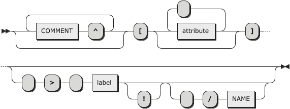

[](https://www.0crat.com/contrib/C63314D6Z)

[](https://www.elegantobjects.org)
[](https://www.0crat.com/p/C63314D6Z)
[](http://www.rultor.com/p/cqfn/eo)
[](https://www.jetbrains.com/idea/)

[](https://travis-ci.org/cqfn/eo)
[](http://www.0pdd.com/p?name=cqfn/eo)
[](https://codeclimate.com/github/cqfn/eo/maintainability)
[](https://hitsofcode.com/view/github/cqfn/eo)
[](https://github.com/cqfn/eo/blob/master/LICENSE.txt)

[](https://maven-badges.herokuapp.com/maven-central/org.eolang/eo-parent)

**EO** (stands for [Elegant Objects](http://www.yegor256.com/elegant-objects.html) or
ISO 639-1 code of [Esperanto](https://en.wikipedia.org/wiki/Esperanto))
is an object-oriented programming language. It's still a prototype.
It's the future of OOP. Please [contribute](https://github.com/cqfn/eo#how-to-contribute)!
By the way, we're aware of popular semi-OOP languages and we don't think
they are good enough, including
[Java](https://en.wikipedia.org/wiki/Java_%28programming_language%29),
[Ruby](https://en.wikipedia.org/wiki/Ruby_%28programming_language%29),
[C++](https://en.wikipedia.org/wiki/C%2B%2B),
[Smalltalk](https://en.wikipedia.org/wiki/Smalltalk),
[Python](https://en.wikipedia.org/wiki/Python_%28programming_language%29),
[PHP](https://en.wikipedia.org/wiki/PHP),
[C#](https://en.wikipedia.org/wiki/C_Sharp_%28programming_language%29):
all of them have something we don't tolerate.

EO is not planning to become a mainstream language&mdash;this is not what
we want. Our main goal is to prove to ourselves that true object-oriented
programming is practically possible. Not just in books and abstract
examples, but in real code that works. That's why EO is being created&mdash;to
put all that "crazy" pure object-oriented ideas into practice and
see whether they can work. It's an experiment, a prototype, a proof-of-concept.

If you want to contribute, please join our
[Telegram chat](https://t.me/elegantobjects) first.

Our Twitter tag is [#eolang](https://twitter.com/search?q=%23eolang).

These things we **don't tolerate**:

  * static/class methods or attributes ([why?](http://www.yegor256.com/2014/05/05/oop-alternative-to-utility-classes.html))
  * classes ([why?](http://www.yegor256.com/2016/09/20/oop-without-classes.html))
  * implementation inheritance ([why?](http://www.yegor256.com/2016/09/13/inheritance-is-procedural.html))
  * mutability ([why?](http://www.yegor256.com/2014/06/09/objects-should-be-immutable.html))
  * NULL ([why?](http://www.yegor256.com/2014/05/13/why-null-is-bad.html))
  * global variables/procedures
  * reflection
  * type casting ([why?](http://www.yegor256.com/2015/04/02/class-casting-is-anti-pattern.html))
  * scalar types and data primitives
  * annotations ([why?](http://www.yegor256.com/2016/04/12/java-annotations-are-evil.html))
  * unchecked exceptions ([why?](http://www.yegor256.com/2015/07/28/checked-vs-unchecked-exceptions.html))
  * operators
  * flow control statements (`for`, `while`, `if`, etc)
  * DSL and [syntactic sugar](https://en.wikipedia.org/wiki/Syntactic_sugar) ([why?](https://github.com/cqfn/eo/issues/51))

We want EO to be compilable to Java. We want to stay as close to Java and JVM
as possible, mostly in order to re-use the eco-system and libraries
already available.

We also want to have the ability to compile it to any other language, like
Python, C/C++, Ruby, C#, etc. In other words, EO must be platform-independent.
## Table of Contents
- [Table of Contents](#table-of-contents)
- [Quick Start](#quick-start)
- [Tutorial](#tutorial)
- [The EO Programming Language Reference](#the-eo-programming-language-reference)
  - [Objects](#objects)
  - [Attributes](#attributes)
    - [Free & Bound Attributes. Binding](#free--bound-attributes-binding)
    - [Accessing Attributes. The Dot Notation](#accessing-attributes-the-dot-notation)
    - [The `@` attribute](#the--attribute)
    - [The `$` attribute](#the--attribute-1)
    - [The `^` attribute](#the--attribute-2)
  - [Abstraction](#abstraction)
  - [Application](#application)
  - [Decoration](#decoration)
  - [Datarization](#datarization)
    - [`!` — Datarize Only Once](#--datarize-only-once)
- [How it Works?](#how-it-works)
- [How to Contribute](#how-to-contribute)
## Quick Start

Here is a simple program that gets a year from the command line and tells you
whether it's leap or not:

```
+alias stdout org.eolang.io.stdout
+alias stdin org.eolang.io.stdin
+alias scanner org.eolang.txt.scanner

[args...] > main
  [y] > leap
    or. > @
      and.
        eq. (mod. y 4) 0
        not. (eq. (mod. y 100) 0)
      eq. (mod. y 400) 0
  stdout > @
    sprintf
      "%d is %sa leap year!"
      (args.get 0).nextInt > year!
      if (leap year:y) "" "not "
```

In order to compile this program, put it into `src/main/eo/main.eo` and then
create a file `pom.xml` with this content (it's just a sample):

```xml
<project>
  [...]
  <build>
    <plugins>
      <plugin>
        <groupId>org.eolang</groupId>
        <artifactId>eo-maven-plugin</artifactId>
        <version>0.1.10</version>
        <executions>
          <execution>
            <goals>
              <goal>parse</goal>
              <goal>optimize</goal>
              <goal>compile</goal>
            </goals>
          </execution>
        </executions>
      </plugin>
      <plugin>
        <groupId>org.codehaus.mojo</groupId>
        <artifactId>exec-maven-plugin</artifactId>
        <executions>
          <execution>
            <phase>test</phase>
            <goals>
              <goal>java</goal>
            </goals>
          </execution>
        </executions>
        <configuration>
          <mainClass>org.eolang.phi.Main</mainClass>
          <arguments>
            <argument>main</argument>
            <argument>2008</argument>
          </arguments>
        </configuration>
      </plugin>
    </plugins>
  </build>
  <dependencies>
    <dependency>
      <groupId>org.eolang</groupId>
      <artifactId>eo-runtime</artifactId>
      <version>0.1.10</version>
    </dependency>
  </dependencies>
</project>
```

Then, you just run `mvn clean test` (you will need [Maven 3.3+](https://maven.apache.org/))
and the `.eo` file will be parsed to `.xml` files, transformed to `.java` files,
and then compiled to `.class` files. You can see them all in the `target` directory.
You will need Java 8+.

More examples are [here](https://github.com/cqfn/eo/tree/master/eo-maven-plugin/src/it).

## Tutorial

Let's start with a simple EO program:

```
+alias stdout org.eolang.io.stdout

[] > app
  stdout > @
    "Hello, world!"
```

Here we create a new [abstract object](https://www.yegor256.com/2020/12/01/abstract-objects.html)
named `app`, which has got a single attribute named `@`. The object attached to the attribute
`@` is a copy of the object `stdout` with a single argument `"Hello, world!"`. The object
`stdout` is also [abstract](https://www.yegor256.com/2020/12/01/abstract-objects.html).
It can't be used directly, a copy of it has to be created, with a few requirement arguments provided.
This is how a copy of the object `stdout` is made:

```
stdout
  "Hello, world!"
```

The indentation in EO is important, just like in Python. There have to be two spaces
in front of the line in order to go to the deeper level of nesting. This code can also be written
in a "horizontal" notation:

```
stdout "Hello, world!"
```

Moreover, it's possible to use brackets in order to group arguments and avoid
ambiguity. For example, instead of using a plain string `"Hello, world!"`
we may want to create a copy of the object `stdout` with a more complex
argument: a copy of the object `sprintf`:

```
+alias stdout org.eolang.io.stdout
+alias sprintf org.eolang.txt.sprintf

[] > app
  stdout > @
    sprintf
      "Hello, %s!"
      "Jeffrey"
```

Here, the object `sprintf` is also [abstract](https://www.yegor256.com/2020/12/01/abstract-objects.html).
It is being copied with two arguments: `"Hello, %s!"` and `"Jeffrey"`. This program
can be written using the horizontal notation:

```
+alias stdout org.eolang.io.stdout
+alias sprintf org.eolang.txt.sprintf

[] > app
  (stdout (sprintf "Hello, %s!" "Jeffrey")) > @
```

The special attribute `@` denotes an object that is being
[decorated](https://www.yegor256.com/2015/02/26/composable-decorators.html).
In this example, the object `app` decorates the copy of the
object `stdout` and through this starts to behave like
the object `stdout`: all attributes of `stdout` become the
attributes of the `app`. The object `app` may have its own
attributes. For example, it's possible to define a new abstract object
inside `app` and use it to build the output string:

```
+alias stdout org.eolang.io.stdout
+alias sprintf org.eolang.txt.sprintf

[] > app
  stdout (msg "Jeffrey") > @
  [name] > msg
    sprintf "Hello, %s!" name > @
```

Now, the object `app` has two "bound" attributes: `@` and `msg`. The attribute
`msg` has an abstract object attached to it, with a single "free" attribute
`name`.

This is how you iterate:

```
+package sandbox
+alias stdout org.eolang.io.stdout
+alias sprintf org.eolang.txt.sprintf

[args...] > app
  memory > x
  seq > @
    x.write 2
    while.
      x.less 6
      [i]
        seq > @
          stdout
            sprintf "%dx%d = %d\n" x x (x.pow 2)
          x.write (x.add 1)

```

This code will print this:

```
2 x 2 = 4
3 x 3 = 9
4 x 4 = 16
5 x 5 = 25
```

Got the idea?

## The EO Programming Language Reference
This section covers the basic principles that the EO programming language relies on. These are objects, attributes, and four elemental operations — abstraction, application, decoration, and datarization.
### Objects
**Objects** are a centric notion of the EO programming language. Essentially, an **object** is a set of *attributes*. An object connects with and links other objects through its attributes to compose a new concept that the object abstracts.  
An **abstract object** is an object that has at least one [free attribute](#free--bound-attributes-binding).  
This is an example of an abstract object:  
```
[a b] > sum
  a.add b > @
  a > leftOperand
  b > rightOperand
```  
A **closed object** is an object whose all attributes are [bound](#free--bound-attributes-binding).  
These are examples of closed objects:  
```
# Application can turn an abstract object to a closed one
sum 2 5 > closedCopyOfSum
# Abstraction can declare closed objects
[] > zero
  0 > @
  "0" > stringValue
  # Closed objects may have abstract attributes
  [x] > add
    sum 0 x > @ 
  # And closed attributes, too
  [] > neg
    -0 > @
  $.add 1 > addOne
```  
### Attributes
An **attribute** is a pair of a name and a value, where a value of an attribute is another object. That is because `Everything in EO is an object`. Hence, for instance, an attribute `name` of an object `person` may be also referred to as plainly the object `name` of the object `person`.  
#### Free & Bound Attributes. Binding
**Binding** is an operation of associating an attribute's value with some object. An attribute may be bound to some object only once.  
An attribute that is not bound to any object is named a **free attribute**. An attribute that has some object associated with its value is called a **bound attribute**.  
*Free attributes* may be declared through the object [abstraction](#abstraction) only.
*Binding* may be performed either during object declaration using the bind (`>`) operator (see the [abstraction](#abstraction) section for more information) or through object copying (see the [application](#application) section for details).
#### Accessing Attributes. The Dot Notation
There are no access modifiers in the EO programming language. All attributes of all objects are publicly visible and accessible. To access attributes of objects, the dot notation is used. The dot notation can be used to retrieve values of attributes and not to bind attributes to objects.   
##### Example. The Horizontal Dot Notation <!-- omit in toc -->
```
(5.add 7).mul 10 > calc
```
##### Example. The Vertical Dot Notation <!-- omit in toc -->
```
mul. > calc
  add.
    5
    7
  10
```
Here, `add` is an attribute of the object `5` and `mul` is an attribute of the attribute object `add` (or, more precisely, an attribute of an object that `add` abstracts or datarizes to, which is an integer number `int`). 
#### The `@` attribute
The `@` attribute is named `phi` (after the Greek letter `φ`). The `@` character is reserved for the `phi` attribute and cannot be used for any other purpose. Every object has its own and only `@` attribute. The `@` attribute can be bound to a value only once.    
The `@` attribute is used for decorating objects. An object bound to the `@` attribute is referred to as a decoratee (i.e., an object that is being decorated) while the base object of the `@` attribute is a decorator (i.e., an object that decorates the decoratee). Since the `@` attribute may be bound only once, every object may have only one decoratee object. More on the decoration see in [this section](#decoration).    
Besides, the `@` attribute is heavily used in the datarization process (see [this section](#datarization) for more information). 
#### The `$` attribute
The `$` character is reserved for the special attributeself` that every object has. The `$` attribute is used to refer to the object itself.  
The `$` attribute may be useful to use the result of the object's datarization process for declaring other object's attributes.  
The `$` attribute may be used to access attributes of an object inside of the object with the dot notation (e.g., `$.attrA`), but this notation is redundant.  
#### The `^` attribute
The `^` attribute is used to refer to the parent object.  
The `^` attribute may be used to access attributes of a parent object inside of the current object with the dot notation (e.g., `^.attrA`). 
##### Example <!-- omit in toc -->
```
[] > parentObject
  42 > magicNumbe
  [] > childObject
    24 > magicNumber
    add. > @
      ^.magicNumber # refers to the parent object's attr
      magicNumber # refers to $.magicNumber
``` 
### Abstraction
**Abstraction** is the operation of declaring a new object. Abstraction allows declaring both abstract and closed, anonymous and named objects.  
If we are to compare abstraction and application, we can conclude that **abstraction** allows broadening the field of concepts (objects) by declaring new objects. *Application* allows enriching the objects declared through *abstraction* by defining the actual links between the concepts. 
#### Syntax <!-- omit in toc -->
The abstraction syntax includes the following elements:  
1. *(optional)* One or more comment lines before (e.g., `# comment`).
2. A sequence of free attributes in square brackets. The sequence may be:
   1. Empty (`[]`). In this case, the declared object has no free attributes.  
   2. Containing one or more attribute names (`[a]` or `[a b c d e]`). In this case, the listed attribute names are the free attributes of the declared object.  
   3. Containing a variable-length attribute (`[animals...]`). The attribute must be at the end of the list of attributes to work properly. Internally, this attribute is represented by the `array` object.
3. *(optional)* Binding to a name (` > myObject`). Declared objects may be anonymous. However, anonymous objects must be used in application only (i.e., we can only supply anonymous objects for binding them to free attributes during application).  
4. *(optional)* The object may be declared as constant (i.e., datarized only once (see [this section](#--datarize-only-once))), if the object is bound to a name (see #3). For this, the `!` operator is used.  
5. *(optional)* The object may be declared as an atom (i.e., its implementation is made out of the EO language (for instance, in Java)) if the object is bound to a name (see #3). For this, the `/` operator is used (for example, `/bool`).  
#### Anonymous Abstraction <!-- omit in toc -->
There are two types of anonymous abstraction: inline and plain multi-line.  
**Plain Multi-line Anonymous Abstraction**   
```
[a b]
  a.add b > @
```
The same can be expressed in just one line.  
**Inline Anonymous Abstraction**  
```
[a b] a.add b
```  
**EBNF**  
```EBNF
abstraction ::= ( COMMENT '^' )*
               '[' ( attribute ( ' ' attribute )* )? ']'
                ( (' ' '>' ' ' label '!'?) ( ' ' '/' NAME )? )?
            
attribute ::= label
label ::= '@' | NAME '...'?
NAME ::= [a-z][a-z0-9_A-Z]*
```
**Railroad Diagram**  
  
#### Examples <!-- omit in toc -->
```
# no free attributes abstraction
[] > magicalObject
  # here we use application to define an attribute
  42 > magicalNumber

  # and here we use abstraction to define an attribute
  [a] > addSomeMagic
    # application again
    magicalNumber.add a > @

# variable-length attribute abstraction
[a b c args...] > app
  # the next five lines are examples of application
  stdout > @
    sprintf
      "\n%d\n%d\n"
      args.get 0
      magicalObject.magicalNumber.add a

# anonymous abstraction
[args...] > app
  reduce. > sum
    args
    0
    [accumulator current] # <--- this is anonymous abstraction
      add. > @
        accumulator
        current.toInt

# inline anonymous abstraction
[args...] > app
  reduce. > sum
    args
    0
    # inline anonymous abstraction
    [accumulator current] accumulator.add (current.toInt)
``` 
### Application
**Application** is the operation of copying an object previously declared with abstraction optionally binding all or part of its free attributes to some objects.  
If we are to compare abstraction and application, we can conclude that *abstraction* allows broadening the field of concepts (objects) by declaring new objects. **Application** produces more concrete and specific copies of objects declared through *abstraction* by defining the actual links between the concepts by binding their free attributes. 
#### Syntax <!-- omit in toc -->
The application syntax is quite wide, so let's point out the constituents to perform the application:  
1. An object being applied/copied.
   1. It may be any existing (i.e., previously declared) object of any form — abstract, closed, anonymous, or named.
   2. It may be also an attribute object. In this case, both horizontal and vertical [dot notations](#accessing-attributes-the-dot-notation) can be used to access that attribute object.
2. A sequence of objects to bind to the free attributes of the applied object. The sequence may be placed in-line (horizontally) or vertically, one indentation level deeper relatively the copied object level. The sequence may be:
   1. Empty. In this case, the applied object will stay abstract or closed, as it was before.  
   2. Containing one or more objects. In this case, the listed objects will be bound to the free attributes of the applied object in their order of appearance.  
   3. Containing one or more objects with names after each (like `1:a 5:b 9:c`). In this case, the listed objects will be bound to the corresponding free attributes of the applied object.
3. *(optional)* Binding to a name (` > myObject`).  
4. *(optional)* The copied object may be declared as constant (i.e., datarized only once (see [this section](#--datarize-only-once))), if the object is bound to a name (see #3). For this, the `!` operator is used.    
#### Partial Application <!-- omit in toc -->
Essentially, application is used to bind free attributes of abstract objects to make their concrete and more specific copies. Application allows binding arbitrary number of free attributes, which can be used to partially apply objects.  
```
# abstract object
[a b] > sum
  a.add b > @

# we can partially apply it to create a new, more specific concept
sum 10 > addTen
# we can apply this copied object, too
addTen 10 > twenty
```
#### Examples <!-- omit in toc -->
```
# here application with no binding
42 > magicalNumber

# horizontal application of 
# the add attribute of the magicalNumber
magicalNumber.add 1 > secondMagicalNumber

# vertical application
# & application inside application
sub. > esotericNumericalEssence
  mul.
    add.
      magicalNumber
      22
    17
  10
``` 
### Decoration
**Decoration** is the operation of extending one object's (`the decoratee`) attributes with attributes of the other object (`the decorator`). Through decoration, the decorator fetches all the attributes of the decoratee and adds up new own attributes. Hence, the decorator represents the decoratee with some extension in the functionality.  
#### Syntax <!-- omit in toc -->  
The decorator's `@` attribute should be bound to the decoratee object in order to perform the decoration operation.  
The syntax for the decoration operation is as follows:  
```
[] > theDecorator
  theDecoratee > @
```
Here, `theDecorator` can access all the attributes of `theDecoratee` and use them to define its own attributes.
#### Example <!-- omit in toc -->
Say, we have the `purchase` object that represents a purchase of some item that has a name, cost, and quantity. The `purchaseTotal` decorates it and adds new functionality of calculating the total.
```
[itemName itemCost itemQuantity] > purchase
  itemName > @

[] > purchaseTotal
  purchase > @
  mul. > total
    @.itemCost
    @.itemQuantity
```
Now we can access all attributes of `purchase` and `purchaseTotal`  through a copy of `purchaseTotal`.
### Datarization
**Datarization** is the operation of evaluation of data laying behind an object. The datarization process (denoted hereby as `D(something)`) is recursive and consists of the following steps:  
1. `D(obj) = obj` if `obj` is a data object. Data objects are `int`, `float`, `string`, `char`, `bytes`.  
2. If the `obj` is an atom (atoms are objects that are implemented outside EO), then `D(obj)` is the data returned by the code behind the atom.  
3. Otherwise, `D(obj) = D(obj.@)`. That is, if the object is neither data nor an atom, then the object "asks" its decoratee to find the data behind it.  
  
It is important to note that if the `@` attribute of the object (or any underlying object in the datarization recursive evaluation tree) is absent (free), then the datarization will fail.  
If we want to datarize the object `x`, all objects and attributes that are used in the definition of the `@` attribute of the `x` will be datarized. Like this, if we want to datarize the attribute `x.attr`, all objects and attributes that are used in the definition of its `@` attribute will be datarized.  
The opposite is true. If the attribute `x.attr` or the object `x` itself are not used in the declaration of `y`, then `D(y)` will not datarize them and they will not be evaluated and executed. Thus, the datarization operation may be referred to as the lazy object evaluation (i.e., EO datarizes objects only when this is needed).    
#### `!` — Datarize Only Once
`not implemented`
## How it Works?

The entire process of turning an `.eo` program into an executable
binary code consists of a few steps, which must be done
one after another:

  * **Parsing**.
    It's done by the `org.eolang.parser.Syntax` class in the `eo-parser` module. It takes
    the source code in a plain text format and parses into an XML document,
    using [ANTLR4](https://www.antlr.org/) and [Xembly](https://www.xembly.org).
    The output of the parser you can find in the `target/eo/parse` directory.

  * **Optimization**.
    There are a number of [XSL transformations](https://en.wikipedia.org/wiki/XSLT)
    that need to be done
    with the XML document in order to make it ready for compilation.
    Each transformation has its own `.xsl` file in the `eo-parser` directory.
    The class `org.eolang.parser.Program` is responsible for making XSLT
    transformations and the entire list of them is stored in the
    `org.eolang.parser.Pack` class. Some of XLST files are sanity checks (or linters).
    The output of each transformation you can find in the `target/eo/optimize` directory.

  * **Compilation**.
    The class `org.eolang.maven.CompileMojo` in the `eo-maven-plugin` module is responsible
    for putting parsing and optimization steps together and then transforming
    the XML document into a collection of `.java` files. There are a number
    of transformations that do this, they all exist in `.xsl` files.
    The output of this step you can find in the `target/generated-sources` directory.

There is also a module called `eo-runtime`, which includes both `.eo` and `.java` code
for the most popular and important objects that any of you will need in order
to write even a simple EO program. There are objects like `string`, `int`, `sprintf`,
`stdout`, and so on. By the way, you may want to contribute to it by creating new objects.

## How to Contribute

Fork repository, make changes, send us a pull request.
We will review your changes and apply them to the `master` branch shortly,
provided they don't violate our quality standards. To avoid frustration,
before sending us your pull request please run full Maven build:

```bash
$ mvn clean install -Pqulice
```

You will need Maven 3.3+ and Java 8+.

