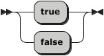

[](https://www.0crat.com/contrib/C63314D6Z)

[](https://www.elegantobjects.org)
[](https://www.0crat.com/p/C63314D6Z)
[](http://www.rultor.com/p/cqfn/eo)
[](https://www.jetbrains.com/idea/)

[](https://travis-ci.org/cqfn/eo)
[](http://www.0pdd.com/p?name=cqfn/eo)
[](https://codeclimate.com/github/cqfn/eo/maintainability)
[](https://hitsofcode.com/view/github/cqfn/eo)
[](https://github.com/cqfn/eo/blob/master/LICENSE.txt)

[](https://maven-badges.herokuapp.com/maven-central/org.eolang/eo-parent)

**EO** (stands for [Elegant Objects](http://www.yegor256.com/elegant-objects.html) or
ISO 639-1 code of [Esperanto](https://en.wikipedia.org/wiki/Esperanto))
is an object-oriented programming language. It's still a prototype.
It's the future of OOP. Please [contribute](https://github.com/cqfn/eo#how-to-contribute)!
By the way, we're aware of popular semi-OOP languages and we don't think
they are good enough, including
[Java](https://en.wikipedia.org/wiki/Java_%28programming_language%29),
[Ruby](https://en.wikipedia.org/wiki/Ruby_%28programming_language%29),
[C++](https://en.wikipedia.org/wiki/C%2B%2B),
[Smalltalk](https://en.wikipedia.org/wiki/Smalltalk),
[Python](https://en.wikipedia.org/wiki/Python_%28programming_language%29),
[PHP](https://en.wikipedia.org/wiki/PHP),
[C#](https://en.wikipedia.org/wiki/C_Sharp_%28programming_language%29):
all of them have something we don't tolerate.

EO is not planning to become a mainstream language&mdash;this is not what
we want. Our main goal is to prove to ourselves that true object-oriented
programming is practically possible. Not just in books and abstract
examples, but in real code that works. That's why EO is being created&mdash;to
put all that "crazy" pure object-oriented ideas into practice and
see whether they can work. It's an experiment, a prototype, a proof-of-concept.

If you want to contribute, please join our
[Telegram chat](https://t.me/elegantobjects) first.

Our Twitter tag is [#eolang](https://twitter.com/search?q=%23eolang).

These things we **don't tolerate**:

  * static/class methods or attributes ([why?](http://www.yegor256.com/2014/05/05/oop-alternative-to-utility-classes.html))
  * classes ([why?](http://www.yegor256.com/2016/09/20/oop-without-classes.html))
  * implementation inheritance ([why?](http://www.yegor256.com/2016/09/13/inheritance-is-procedural.html))
  * mutability ([why?](http://www.yegor256.com/2014/06/09/objects-should-be-immutable.html))
  * NULL ([why?](http://www.yegor256.com/2014/05/13/why-null-is-bad.html))
  * global variables/procedures
  * reflection
  * type casting ([why?](http://www.yegor256.com/2015/04/02/class-casting-is-anti-pattern.html))
  * scalar types and data primitives
  * annotations ([why?](http://www.yegor256.com/2016/04/12/java-annotations-are-evil.html))
  * unchecked exceptions ([why?](http://www.yegor256.com/2015/07/28/checked-vs-unchecked-exceptions.html))
  * operators
  * flow control statements (`for`, `while`, `if`, etc)
  * DSL and [syntactic sugar](https://en.wikipedia.org/wiki/Syntactic_sugar) ([why?](https://github.com/cqfn/eo/issues/51))

We want EO to be compilable to Java. We want to stay as close to Java and JVM
as possible, mostly in order to re-use the eco-system and libraries
already available.

We also want to have an ability to compile it to any other language, like
Python, C/C++, Ruby, C#, etc. In other words, EO must be platform
independent.

## Quick Start

Here is a simple program that gets a year from command line and tells you
whether it's leap or not:

```
+alias stdout org.eolang.io.stdout
+alias stdin org.eolang.io.stdin
+alias scanner org.eolang.txt.scanner

[args...] > main
  [y] > leap
    or. > @
      and.
        eq. (mod. y 4) 0
        not. (eq. (mod. y 100) 0)
      eq. (mod. y 400) 0
  stdout > @
    sprintf
      "%d is %sa leap year!"
      (args.get 0).nextInt > year!
      if (leap year:y) "" "not "
```

In order to compile this program, put it into `src/main/eo/main.eo` and then
create a file `pom.xml` with this content (it's just a sample):

```xml
<project>
  [...]
  <build>
    <plugins>
      <plugin>
        <groupId>org.eolang</groupId>
        <artifactId>eo-maven-plugin</artifactId>
        <version>0.1.10</version>
        <executions>
          <execution>
            <goals>
              <goal>parse</goal>
              <goal>optimize</goal>
              <goal>compile</goal>
            </goals>
          </execution>
        </executions>
      </plugin>
      <plugin>
        <groupId>org.codehaus.mojo</groupId>
        <artifactId>exec-maven-plugin</artifactId>
        <executions>
          <execution>
            <phase>test</phase>
            <goals>
              <goal>java</goal>
            </goals>
          </execution>
        </executions>
        <configuration>
          <mainClass>org.eolang.phi.Main</mainClass>
          <arguments>
            <argument>main</argument>
            <argument>2008</argument>
          </arguments>
        </configuration>
      </plugin>
    </plugins>
  </build>
  <dependencies>
    <dependency>
      <groupId>org.eolang</groupId>
      <artifactId>eo-runtime</artifactId>
      <version>0.1.10</version>
    </dependency>
  </dependencies>
</project>
```

Then, you just run `mvn clean test` (you will need [Maven 3.3+](https://maven.apache.org/))
and the `.eo` file will be parsed to `.xml` files, transformed to `.java` files,
and then compiled to `.class` files. You can see them all in the `target` directory.
You will need Java 8+.

More examples are [here](https://github.com/cqfn/eo/tree/master/eo-maven-plugin/src/it).

## Tutorial

Let's start with a simple EO program:

```
+alias stdout org.eolang.io.stdout

[] > app
  stdout > @
    "Hello, world!"
```

Here we create a new [abstract object](https://www.yegor256.com/2020/12/01/abstract-objects.html)
named `app`, which has got a single attribute named `@`. The object attached to the attribute
`@` is a copy of the object `stdout` with a single argument `"Hello, world!"`. The object
`stdout` is also [abstract](https://www.yegor256.com/2020/12/01/abstract-objects.html).
It can't be used directly, a copy of it has to be created, with a few requirement arguments provided.
This is how a copy of the object `stdout` is made:

```
stdout
  "Hello, world!"
```

The indentation in EO is important, just like in Python. There have to be two spaces
in front of the line in order to go to the deeper level of nesting. This code can also be written
in a "horizontal" notation:

```
stdout "Hello, world!"
```

Moreover, it's possible to use brackets in order to group arguments and avoid
ambiguity. For example, instead of using a plain string `"Hello, world!"`
we may want to create a copy of the object `stdout` with a more complex
argument: a copy of the object `sprintf`:

```
+alias stdout org.eolang.io.stdout
+alias sprintf org.eolang.txt.sprintf

[] > app
  stdout > @
    sprintf
      "Hello, %s!"
      "Jeffrey"
```

Here, the object `sprintf` is also [abstract](https://www.yegor256.com/2020/12/01/abstract-objects.html).
It is being copied with two arguments: `"Hello, %s!"` and `"Jeffrey"`. This program
can be written using horizontal notation:

```
+alias stdout org.eolang.io.stdout
+alias sprintf org.eolang.txt.sprintf

[] > app
  (stdout (sprintf "Hello, %s!" "Jeffrey")) > @
```

The special attribute `@` denotes an object that is being
[decorated](https://www.yegor256.com/2015/02/26/composable-decorators.html).
In this example, the object `app` decorates the copy of the
object `stdout` and through this starts to behave like
the object `stdout`: all attributes of `stdout` become the
attributes of the `app`. The object `app` may have its own
attributes. For example, it's possible to define a new abstract object
inside `app` and use it to build the output string:

```
+alias stdout org.eolang.io.stdout
+alias sprintf org.eolang.txt.sprintf

[] > app
  stdout (msg "Jeffrey") > @
  [name] > msg
    sprintf "Hello, %s!" name > @
```

Now, the object `app` has two "bound" attributes: `@` and `msg`. The attribute
`msg` has an abstract object attached to it, with a single "free" attribute
`name`.

This is how you iterate:

```
+alias stdout org.eolang.io.stdout
+alias sprintf org.eolang.txt.sprintf

[] > app
  memory > x
  and. > @
    x.write 2
    while.
      x.less 6
      [i]
        seq > @
          stdout
            sprintf "%dx%d = %d" x x (x.pow 2)
          x.write (x.add 1)
```

This code will print this:

```
2 x 2 = 4
3 x 3 = 9
4 x 4 = 16
5 x 5 = 25
```

Got the idea?  

## The EO Programming Language Standard Library
This section covers *The EO Standard Library* which is a collection of utility objects for writing programs in *EO*.  
### The EO Data Types Objects  
*The EO Programming Language* defines these data types objects: `bool`, `int`, `float`, `string`, `char`, and `array`. 
#### `bool` Data Type Object
The `bool` data type object has two possible values: `true` and `false`. The `bool` data type object is used as a boolean value for performing logical operations.
##### Syntax
The `bool` data type object values may be parsed by the EO compiler directly from the source code. The syntax rules for values are as follows.  
**EBNF Notation**  
```EBNF
BOOL     ::= 'true'
           | 'false'
```
**Railroad Diagram**  
  
###### Example
```
+package sandbox
+alias sprintf org.eolang.txt.sprintf
+alias stdout org.eolang.io.stdout

[args...] > app
  stdout > @
    sprintf
      "%b\n%b\n"
      true
      false

```
**Running**  
```
IN$: ./run.sh
OUT>: true
OUT>: false
IN$: 
```
##### `if` Attribute
The `if` attribute object is used for value substitution based on a condition that can be evaluated as a `bool` object.  
The `if` attribute object has two free attributes:  
1. `t` for the substitution in case if the base `bool` object is `true`.  
2. `f` for the substitution in case if the base `bool` object is `false`.  
  
If the `if` attribute object is fully applied (i.e. all the free attributes are bound), its `@` (phi) attribute contains the resulting substitution.  
###### Example
```
+package sandbox
+alias sprintf org.eolang.txt.sprintf
+alias stdout org.eolang.io.stdout

[args...] > app
  stdout > @
    sprintf
      "%s\n%s\n%s\nThe max(2, 5) is: %d\n"
      true.if
        "the first value is true"
        "the first value is false"
      false.if
        "the second value is true"
        "the second value is false"
      if.
        2.less 3
        "2 is less than 3"
        "2 is not less than 3"
      (5.less 2).if
        2
        5

```
**Running**  
```
IN$: ./run.sh
OUT>: the first value is true
OUT>: the second value is false
OUT>: 2 is less than 3
OUT>: The max(2, 5) is: 5
IN$: 
```
##### `not` Attribute
The `not` attribute object is the object with the inversed value of its base `bool` object.  
The `not` attribute object has no free attributes. When the `not` attribute object is applied (called), its `@` (phi) attribute contains the resulting substitution.    

###### Example
In this example, all the answers from the previous example (the `if` attribute section) are inversed with the `not` attribute.  
```
+package sandbox
+alias sprintf org.eolang.txt.sprintf
+alias stdout org.eolang.io.stdout

[args...] > app
  stdout > @
    sprintf
      "[NOT Edition (all the answers are inversed with .not)]\n%s\n%s\n%s\nThe max(2, 5) is: %d\n"
      true.not.if
        "the first value is true"
        "the first value is false"
      false.not.if
        "the second value is true"
        "the second value is false"
      if.
        (2.less 3).not
        "2 is less than 3"
        "2 is not less than 3"
      (5.less 2).not.if
        2
        5

```
**Running**  
```
IN$: ./run.sh
OUT>: [NOT Edition (all the answers are inversed with .not)]
OUT>: the first value is false
OUT>: the second value is true
OUT>: 2 is not less than 3
OUT>: The max(2, 5) is: 2
IN$: 
```
##### `and` Attribute
The `and` attribute object is used to perform logical conjunction operation on a variety of `bool` objects.  
The `and` attribute object has one free attribute `x` for the `bool` objects (conjuncts) on which the logical conjunction operation is to be performed. `x` may be empty or may have any number of `bool` objects.  
  
If the `and` attribute object is applied, its `@` (phi) attribute contains the resulting conjunction of the base `bool` object and all the objects bounded to the `x` attribute of the `and` attribute object.    
###### Example
```
+package sandbox
+alias sprintf org.eolang.txt.sprintf
+alias stdout org.eolang.io.stdout

[args...] > app
  true > a
  true > b
  true > c
  false > d
  stdout > @
    sprintf
      "a && b = %b\na && b && c = %b\na && b && c && d = %b\n"
      a.and b
      a.and b c
      and.
        a
        b
        c
        d

```
**Running**  
```
IN$: ./run.sh
OUT>: a && b = true
OUT>: a && b && c = true
OUT>: a && b && c && d = false
IN$: 
```
##### `or` Attribute
The `or` attribute object is used to perform logical disjunction operation on a variety of `bool` objects.  
The `or` attribute object has one free attribute `x` for the `bool` objects (disjuncts) on which the logical disjunction operation is to be performed. `x` may be empty or may have any number of `bool` objects.  
  
If the `or` attribute object is applied, its `@` (phi) attribute contains the resulting disjunction of the base `bool` object and all the objects bounded to the `x` attribute of the `or` attribute object.    
###### Example
```
+package sandbox
+alias sprintf org.eolang.txt.sprintf
+alias stdout org.eolang.io.stdout

[args...] > app
  false > a
  false > b
  false > c
  true > d
  stdout > @
    sprintf
      "a || b = %b\na || b || c = %b\na || b || c || d = %b\n"
      a.or b
      a.or b c
      or.
        a
        b
        c
        d

```
**Running**  
```
IN$: ./run.sh
OUT>: a || b = false
OUT>: a || b || c = false
OUT>: a || b || c || d = true
IN$: 
```
##### `while` Attribute
`TODO`
#### `float` Data Type Object
The `float` data type object values range is the same as of `double` data type in Java (which is a double-precision 64-bit IEEE 754 floating point). The `float` data type object is used to perform `FPU` computations.
##### Syntax
The `float` data type object values may be parsed by the EO compiler directly from the source code. The syntax rules for values are as follows.  
**EBNF Notation**  
```EBNF
FLOAT    ::= ( '+' | '-' )? [0-9]+ '.' [0-9]+
```
**Railroad Diagram**  
  
###### Example
```
+package sandbox
+alias sprintf org.eolang.txt.sprintf
+alias stdout org.eolang.io.stdout

[args...] > app
  stdout > @
    sprintf
      "%f\n%f\n"
      1.5
      -3.71

```
**Running**  
```
IN$: ./run.sh
OUT>: 1.500000
OUT>: -3.710000
IN$: 
```
##### `eq` Attribute
The `eq` attribute object is used for testing if two `float` objects are equal.    
The `eq` attribute object has one free attribute `x` of type `float`, which is the second object (the first object is the base object of the `eq` attribute).    
If the `eq` attribute object is fully applied (i.e. the free attribute is bound), its `@` (phi) attribute contains either `true` (if the objects are equal) or `false` (otherwise).  
###### Example
```
+package sandbox
+alias sprintf org.eolang.txt.sprintf
+alias stdout org.eolang.io.stdout

[args...] > app
  stdout > @
    sprintf
      "%b\n%b\n"
      1.5.eq 1.5
      -3.71.eq 3.71

```
**Running**  
```
IN$: ./run.sh
OUT>: true
OUT>: false
IN$: 
```
### Command Line Interface Output
*The EO Standard Library* contains two objects for the CLI output: `sprintf` for strings formatting and `stdout` for plain text output. 
#### Plain Text Output. `stdout`
For plain text output, the `stdout` object is used.   
**Fully Qualified Name:** `org.eolang.io.stdout`.
##### Usage
The `stdout` object has one free attribute `text` which should be bounded to the text to be printed.  
The object bounded to the `text` attribute must be of `string` type.  
The `stdout` does not put the End of Line character at the end of the output, so the `\n` escape sequence should be used in case if such a behavior is needed.  
For the complete list of escape sequences supported by `stdout`, see the corresponding section of [the article](https://docs.oracle.com/javase/tutorial/java/data/characters.html).  
##### Example 1. The Plain Old “Hello, World”
```
+package sandbox
+alias stdout org.eolang.io.stdout

[args...] > app
  (stdout "Hello, World!\n") > @
```
In this example, we apply (or copy) an abstract `stdout` object by bounding its free attribute `text` to the object `"Hello, World!\n"` of type `string`.  
Next, we bound the resulting copy of the object to the `@` (phi) attribute of the `app` object. 
###### Running
```
IN$: ./run.sh
OUT>: Hello, World!
IN$: 
```

##### Example 2. Print the First Word of the User's Input
```
+package sandbox
+alias stdout org.eolang.io.stdout

[args...] > app
  stdout > @
    get.
      args
      0
```
In this example, we apply (or copy) an abstract `stdout` object by bounding its free attribute `text` to the attribute `get` of the `args` object, whose free attribute `i` (index) is bounded to the object `0` of type `int`.  
Next, we bound the resulting copy of the object to the `@` (phi) attribute of the `app` object.  
Conceptually, we extract the first word the user types in the command line when running the application and then print the word back. 
###### Running
```
IN$: ./run.sh Hello Bye Thanks Ok
OUT>: HelloIN$: 
```
**Note:** here the `Hello` is printed with no `EOL` character at the end of the line, because of the absence of it in the user input. 

#### Formatting String. `sprintf`
For strings formatting, the `sprintf` object is used.  
String formatting is the process of data injection into the string, optionally applying format patterns to the data.  
**Fully Qualified Name:** `org.eolang.txt.sprintf`.
##### Usage
The `sprintf` object has two free attributes:  
1. `format` for the format `string` that describes the formatting of the resulting string.
2. `args` for the data being injected into the string. `args` may be empty or may have any number of objects. `args` must be consistent with the `format` (i.e. the number and the types (as well as their order) of objects in the `format` and the `args` should be the same).    
  
If the `sprintf` object is fully applied (i.e. all the attributes are bound), its `@` (phi) attribute contains the resulting formatted object of type 'string'.  
For the `format` syntax reference, see [this article](https://docs.oracle.com/javase/8/docs/api/java/util/Formatter.html#syntax).  
##### Example. Format 'Em All
```
+package sandbox
+alias sprintf org.eolang.txt.sprintf
+alias stdout org.eolang.io.stdout

[args...] > app
  sprintf > formatted_string
    "int: %d, bool: %b, string: %s\n"
    2
    (2.less 0)
    "Hey"

  (stdout formatted_string) > @

```
In this example, we apply (or copy) an abstract `sprintf` object by bounding its free attribute `format` to the object `"int: %d, bool: %b, string: %s\n"` of type `string` and its free attribute `args` to objects `2` of type `int`, `2.less 0` (which is the object `false`) of type `bool`, and `"Hey"` of type `string`.  
Next, we bound the resulting copy of the object to the `formatted_string` identifier.  
Then, we supply the `formatted_string` for its application to `stdout`.  
Finally, we bound the resulting copy of the object `stdout` to the `@` (phi) attribute of the `app` object.  
Conceptually, we format the string and then print it to the terminal.  
###### Running
```
IN$: ./run.sh
OUT>: int: 2, bool: false, string: Hey
IN$: 
```
### Random Number Generation. `random`
*The EO Standard Library* contains the `random` object for generating a cryptographically strong random number.  
**Fully Qualified Name:** `org.eolang.random` (the object is automatically imported, so no aliasing or FQN reference required).  
#### Usage
The `random` object has no free attributes. On its initialization, the `random` object's `@` (phi) attribute is bounded to the generated random number, which is immutable (i.e. cannot be changed or generated again in the scope of the initialized object). So, every time the new random number is needed, the new application (initialization) of the `random` object is needed.     
The resulting random number bounded to the `@` attribute of the `random` object is of type `float`.  
The value is in the range 0.0 (inclusive) to 1.0 (exclusive).  
#### Example
```
+package sandbox
+alias sprintf org.eolang.txt.sprintf
+alias stdout org.eolang.io.stdout

[args...] > app
  sprintf > formatted_string
    "the 1st random: %f\nthe 2nd random: %f\nthe 3rd random:%f\n"
    random
    random
    random

  (stdout formatted_string) > @

```
In this example, we apply (or copy) an abstract `sprintf` object by bounding its free attribute `format` to the object `"the 1st random: %f\nthe 2nd random: %f\nthe 3rd random:%f\n"` of type `string` and its free attribute `args` to three unique instances of the `random` object.  
Next, we bound the resulting copy of the object to the `formatted_string` identifier.  
Then, we supply the `formatted_string` for its application to `stdout`.  
Finally, we bound the resulting copy of the object `stdout` to the `@` (phi) attribute of the `app` object.  
Conceptually, we format the string by injecting three random values in it and then print it to the terminal.  
##### Running
```
IN$: ./run.sh
OUT>: the 1st random: 0.125293
OUT>: the 2nd random: 0.074904
OUT>: the 3rd random:0.958538
IN$: 
```

## How it Works?

The entire process of turning an `.eo` program into an executable
binary code constists of a few steps, which must be done
one after another:

  * **Parsing**.
    It's done by the `org.eolang.parser.Syntax` class in the `eo-parser` module. It takes
    the source code in a plain text format and parses into XML document,
    using [ANTLR4](https://www.antlr.org/) and [Xembly](https://www.xembly.org).
    The output of the parser you can find in the `target/eo/parse` directory.

  * **Optimization**.
    There are a number of [XSL transformations](https://en.wikipedia.org/wiki/XSLT)
    that need to be done
    with the XML document in order to make it ready for compilation.
    Each transformation has its own `.xsl` file in the `eo-parser` directory.
    The class `org.eolang.parser.Program` is responsible for making XSLT
    transformations and the entire list of them is stored in the
    `org.eolang.parser.Pack` class. Some of XLST files are sanity checks (or linters).
    The output of each transformation you can find in the `target/eo/optimize` directory.

  * **Compilation**.
    The class `org.eolang.maven.CompileMojo` in the `eo-maven-plugin` module is responsible
    for putting parsing and optimization steps together and then transforming
    the XML document into a collection of `.java` files. There are a number
    of transformations that do this, they all exist in `.xsl` files.
    The output of this step you can find in the `target/generated-sources` directory.

There is also a module called `eo-runtime`, which includes both `.eo` and `.java` code
for most popular and important objects that any of you will need in order
to write even a simple EO program. There are objects like `string`, `int`, `sprintf`,
`stdout`, and so on. By the way, you may want to contribute there by creating new objects.

## How to Contribute

Fork repository, make changes, send us a pull request.
We will review your changes and apply them to the `master` branch shortly,
provided they don't violate our quality standards. To avoid frustration,
before sending us your pull request please run full Maven build:

```bash
$ mvn clean install -Pqulice
```

You will need Maven 3.3+ and Java 8+.

