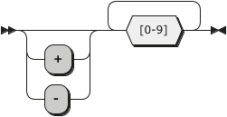

## The EO Standard Object Collection
This section covers *The EO Standard Object Collection* which is a library of utility objects for writing programs in *EO*.  
- [The EO Standard Object Collection](#the-eo-standard-object-collection)
  - [Data Type Objects](#data-type-objects)
    - [`bool` Data Type Object](#bool-data-type-object)
      - [Syntax](#syntax)
      - [`if` Attribute](#if-attribute)
      - [`not` Attribute](#not-attribute)
      - [`and` Attribute](#and-attribute)
      - [`or` Attribute](#or-attribute)
      - [`while` Attribute](#while-attribute)
    - [`float` Data Type Object](#float-data-type-object)
      - [Syntax](#syntax-1)
      - [`eq` Attribute](#eq-attribute)
    - [`string` Data Type Object](#string-data-type-object)
      - [Syntax](#syntax-2)
      - [`eq` Attribute](#eq-attribute-1)
      - [`trim` Attribute](#trim-attribute)
      - [`toInt` Attribute](#toint-attribute)
    - [`int` Data Type Object](#int-data-type-object)
      - [Syntax](#syntax-3)
      - [`eq` Attribute](#eq-attribute-2)
      - [`less` Attribute](#less-attribute)
      - [`add` Attribute](#add-attribute)
      - [`sub` Attribute](#sub-attribute)
      - [`neg` Attribute](#neg-attribute)
      - [`mul` Attribute](#mul-attribute)
      - [`div` Attribute](#div-attribute)
      - [`mod` Attribute](#mod-attribute)
      - [`pow` Attribute](#pow-attribute)
    - [`char` Data Type Object](#char-data-type-object)
      - [Syntax](#syntax-4)
  - [Command Line Interface Output](#command-line-interface-output)
    - [Plain Text Output. `stdout`](#plain-text-output-stdout)
    - [Formatting Strings. `sprintf`](#formatting-strings-sprintf)
  - [Random Number Generation. `random`](#random-number-generation-random)
  - [Arrays](#arrays)
    - [`get` Attribute](#get-attribute)
    - [`append` Attribute](#append-attribute)
    - [`reduce` Attribute](#reduce-attribute)
    - [`map` Attribute](#map-attribute)
    - [`mapi` Attribute](#mapi-attribute)
  - [Sequencing Computations. `seq`](#sequencing-computations-seq)
  - [Mutable Storage in Memory. `memory`](#mutable-storage-in-memory-memory)
### Data Type Objects  
*The EO Programming Language* and *The EO Standard Object Collection* defines these data type objects: `bool`, `int`, `float`, `string`, `char`. 
#### `bool` Data Type Object
The `bool` data type object represents a boolean value (either `true` or `false`) that can be used for performing logical operations.  
**Fully Qualified Name:** `org.eolang.bool` (no aliasing or FQN reference required since the object is automatically imported).  
##### Syntax
The `bool` data type object may be parsed by the EO compiler directly from the source code. The syntax rules for `bool` values are as follows.  
**EBNF Notation**  
```EBNF
BOOL     ::= 'true'
           | 'false'
```
**Railroad Diagram**  
  
###### Example <!-- omit in toc -->
```
+package sandbox
+alias sprintf org.eolang.txt.sprintf
+alias stdout org.eolang.io.stdout

[args...] > app
  stdout > @
    sprintf
      "%b\n%b\n"
      true
      false

```
**Running**   
```
IN$: ./run.sh
OUT>: true
OUT>: false
IN$: 
```
##### `if` Attribute
The `if` attribute object is used for value substitution based on a condition that can be evaluated as a `bool` object.  
The `if` attribute object has two free attributes:  
1. `t` for the substitution if the base `bool` object is `true`.  
2. `f` for the substitution if the base `bool` object is `false`.  
  
If the `if` attribute object is fully applied, it represents the corresponding substitution value.   
###### Example <!-- omit in toc -->
```
+package sandbox
+alias sprintf org.eolang.txt.sprintf
+alias stdout org.eolang.io.stdout

[args...] > app
  stdout > @
    sprintf
      "%s\n%s\n%s\nThe max(2, 5) is: %d\n"
      true.if
        "the first value is true"
        "the first value is false"
      false.if
        "the second value is true"
        "the second value is false"
      if.
        2.less 3
        "2 is less than 3"
        "2 is not less than 3"
      (5.less 2).if
        2
        5

```
**Running**  
```
IN$: ./run.sh
OUT>: the first value is true
OUT>: the second value is false
OUT>: 2 is less than 3
OUT>: The max(2, 5) is: 5
IN$: 
```
##### `not` Attribute
The `not` attribute object represents a `bool` object with the inversed inner value of its base `bool` object.  
The `not` attribute object has no free attributes.  
###### Example <!-- omit in toc -->
In this example, all the answers from the previous example (the `if` attribute section) are inversed with the `not` attribute.  
```
+package sandbox
+alias sprintf org.eolang.txt.sprintf
+alias stdout org.eolang.io.stdout

[args...] > app
  stdout > @
    sprintf
      "[NOT Edition (all the answers are inversed with .not)]\n%s\n%s\n%s\nThe max(2, 5) is: %d\n"
      true.not.if
        "the first value is true"
        "the first value is false"
      false.not.if
        "the second value is true"
        "the second value is false"
      if.
        (2.less 3).not
        "2 is less than 3"
        "2 is not less than 3"
      (5.less 2).not.if
        2
        5

```
**Running**  
```
IN$: ./run.sh
OUT>: [NOT Edition (all the answers are inversed with .not)]
OUT>: the first value is false
OUT>: the second value is true
OUT>: 2 is not less than 3
OUT>: The max(2, 5) is: 2
IN$: 
```
##### `and` Attribute
The `and` attribute object represents logical conjunction on a variety of `bool` objects.  
The `and` attribute object has one free attribute `x` for the `bool` objects (conjuncts). `x` may be empty or may have any number of `bool` objects.  
  
If the `and` attribute object is applied, it represents the conjunction of the base `bool` object and all the objects bound to the `x` attribute.  
###### Example <!-- omit in toc -->
```
+package sandbox
+alias sprintf org.eolang.txt.sprintf
+alias stdout org.eolang.io.stdout

[args...] > app
  true > a
  true > b
  true > c
  false > d
  stdout > @
    sprintf
      "a && b = %b\na && b && c = %b\na && b && c && d = %b\n"
      a.and b
      a.and b c
      and.
        a
        b
        c
        d

```
**Running**  
```
IN$: ./run.sh
OUT>: a && b = true
OUT>: a && b && c = true
OUT>: a && b && c && d = false
IN$: 
```
##### `or` Attribute
The `or` attribute object represents logical disjunction on a variety of `bool` objects.  
The `or` attribute object has one free attribute `x` for the `bool` objects (disjuncts). `x` may be empty or may have any number of `bool` objects.  
  
If the `or` attribute object is applied, it represents the disjunction of the base `bool` object and all the objects bound to the `x` attribute.    
###### Example <!-- omit in toc -->
```
+package sandbox
+alias sprintf org.eolang.txt.sprintf
+alias stdout org.eolang.io.stdout

[args...] > app
  false > a
  false > b
  false > c
  true > d
  stdout > @
    sprintf
      "a || b = %b\na || b || c = %b\na || b || c || d = %b\n"
      a.or b
      a.or b c
      or.
        a
        b
        c
        d

```
**Running**  
```
IN$: ./run.sh
OUT>: a || b = false
OUT>: a || b || c = false
OUT>: a || b || c || d = true
IN$: 
```
##### `while` Attribute
The `while` attribute object is used to evaluate its `f` free attribute until the base `bool` object is not `false`.  
The `f` attribute object must have the free attribute `i` (the current iteration of the `while` loop).  
On datarization, the `while` attribute object evaluates to the number of iterations the loop took.  
Since objects are immutable, the `memory` object should be used as the loop condition (i.e., the base `bool` object of the `while` attribute). Moreover, the `memory` object should be changed somehow inside the `f`, otherwise the `while` will evaluate infinitely. 
###### Example <!-- omit in toc -->
```
+package sandbox
+alias stdout org.eolang.io.stdout
+alias sprintf org.eolang.txt.sprintf

[args...] > app
  memory > x
  seq > @
    x.write 0
    while.
      x.less 11
      [i]
        seq > @
          stdout
            sprintf "%d x %d x %d = %d\n" x x i (x.mul (x.mul i))
          x.write (x.add 1)

```
Here, the `i` attribute of the `f` iteration object is used to find the `x^3`. However, the `i` attribute may stay unused inside the `f`.  
**Running**  
```
IN$: ./run.sh
OUT>: 0 x 0 x 0 = 0
OUT>: 1 x 1 x 1 = 1
OUT>: 2 x 2 x 2 = 8
OUT>: 3 x 3 x 3 = 27
OUT>: 4 x 4 x 4 = 64
OUT>: 5 x 5 x 5 = 125
OUT>: 6 x 6 x 6 = 216
OUT>: 7 x 7 x 7 = 343
OUT>: 8 x 8 x 8 = 512
OUT>: 9 x 9 x 9 = 729
OUT>: 10 x 10 x 10 = 1000
IN$: 
```
#### `float` Data Type Object
The `float` data type object represents a double-precision 64-bit IEEE 754 floating-point number and can be used to perform various `FPU` computations.  
**Fully Qualified Name:** `org.eolang.float` (no aliasing or FQN reference required since the object is automatically imported).  
##### Syntax
The `float` data type object may be parsed by the EO compiler directly from the source code. The syntax rules for values are as follows.  
**EBNF Notation**  
```EBNF
FLOAT    ::= ( '+' | '-' )? [0-9]+ '.' [0-9]+
```
**Railroad Diagram**  
  
###### Example <!-- omit in toc -->
```
+package sandbox
+alias sprintf org.eolang.txt.sprintf
+alias stdout org.eolang.io.stdout

[args...] > app
  stdout > @
    sprintf
      "%f\n%f\n"
      1.5
      -3.71

```
**Running**  
```
IN$: ./run.sh
OUT>: 1.500000
OUT>: -3.710000
IN$: 
```
##### `eq` Attribute
The `eq` attribute object is used for testing if two `float` objects are equal.    
The `eq` attribute object has one free attribute `x` of type `float` that is the second object (the first object is the base object of the `eq` attribute).    
If the `eq` attribute object is applied, it represents the result of the equality test (either `true` (if the objects are equal) or `false` (otherwise)).  
###### Example <!-- omit in toc -->
```
+package sandbox
+alias sprintf org.eolang.txt.sprintf
+alias stdout org.eolang.io.stdout

[args...] > app
  stdout > @
    sprintf
      "%b\n%b\n"
      1.5.eq 1.5
      -3.71.eq 3.71

```
**Running**  
```
IN$: ./run.sh
OUT>: true
OUT>: false
IN$: 
```
#### `string` Data Type Object
The `string` data type object represents a string literal.  
**Fully Qualified Name:** `org.eolang.string` (no aliasing or FQN reference required since the object is automatically imported).  
##### Syntax
The `string` data type object may be parsed by the EO compiler directly from the source code. The syntax rules for values are as follows.  
**EBNF Notation**  
```EBNF
STRING   ::= '"' ( '\"' | [^"] )* '"'
```
**Railroad Diagram**  
  
###### Example <!-- omit in toc -->
```
+package sandbox
+alias sprintf org.eolang.txt.sprintf
+alias stdout org.eolang.io.stdout

[args...] > app
  stdout > @
    sprintf
      "%s%s%s"
      "Hello, "
      "World! Welcome to The \"EO Docs\"!"
      "\n"

```
**Running**  
```
IN$: ./run.sh
OUT>: Hello, World! Welcome to The "EO Docs"!
IN$: 
```
##### `eq` Attribute
The `eq` attribute object is used for testing if two `string` objects are equal.    
The `eq` attribute object has one free attribute `x` of type `string` that is the second object (the first object is the base object of the `eq` attribute).    
If the `eq` attribute object is fully applied, it represents the result of the equality test (either `true` (if the objects are equal) or `false` (otherwise)).  
###### Example <!-- omit in toc -->
```
+package sandbox
+alias sprintf org.eolang.txt.sprintf
+alias stdout org.eolang.io.stdout

[args...] > app
  stdout > @
    sprintf
      "%b\n%b\n%b\n"
      "".eq ""
      "Hey".eq "Hey"
      "Hey".eq "hey"

```
**Running**  
```
IN$: ./run.sh
OUT>: true
OUT>: true
OUT>: false
IN$: 
```
##### `trim` Attribute
The `trim` attribute object is used for trimming the base `string` object (i.e. `trim` is a `string` with whitespace removed from both ends of the base `string`).    
The `trim` attribute object has no free attributes.  
If the `trim` attribute object is applied (called), it represents the resulting trimmed `string`.  
###### Example <!-- omit in toc -->
```
+package sandbox
+alias sprintf org.eolang.txt.sprintf
+alias stdout org.eolang.io.stdout

[args...] > app
  stdout > @
    sprintf
      "%s%s%s"
      "  Hello There  ".trim
      "            !           ".trim
      "\n".trim

```
**Running**  
```
IN$: ./run.sh
OUT>: Hello There!IN$: 
```
Here, the `\n` escape sequence is trimmed as it is a whitespace character. 
##### `toInt` Attribute
The `toInt` attribute object is used for parsing the base `string` object as an `int` object.  
The format of the base `string` object must be as described below:  
1. The first character of the `string` literal may be either `+` or `-`. This indicates the sign of the `int` value. The sign may be omitted (in such a case, the number is positive).  
2. All the other characters of the `string` literal must be decimal digits (`0-9`). 
  
If the format of the base `string` object is incorrect, the `toInt` attribute will fail on its application.  
The `toInt` attribute object has no free attributes.  
If the `toInt` attribute object is applied (called), it represents the parsed `int` object.  
###### Example <!-- omit in toc -->
```
+package sandbox
+alias sprintf org.eolang.txt.sprintf
+alias stdout org.eolang.io.stdout

[args...] > app
  stdout > @
    sprintf
      "%d\n%d\n%d\n%d\n"
      "1700".toInt
      "-1500".toInt
      "8".toInt
      "-0".toInt

```
**Running**  
```
IN$: ./run.sh
OUT>: 1700
OUT>: -1500
OUT>: 8
OUT>: 0
IN$: 
```
#### `int` Data Type Object
The `int` data type object represents a 64-bit integer number.  
**Fully Qualified Name:** `org.eolang.int` (no aliasing or FQN reference required since the object is automatically imported).  
##### Syntax
The `int` data type object may be parsed by the EO compiler directly from the source code. The syntax rules for values are as follows.  
**EBNF Notation**  
```EBNF
INT      ::= ( '+' | '-' )? [0-9]+
```
There is also an alternative syntax for hexadecimal numerals (i.e., with the base `16`). This notation implies only non-negative values.
```EBNF
HEX      ::= '0x' [0-9a-f]+
```
**Railroad Diagram**  
  
And an alternative notation for HEX integers:  
")  
###### Example <!-- omit in toc -->
```
+package sandbox
+alias sprintf org.eolang.txt.sprintf
+alias stdout org.eolang.io.stdout

[args...] > app
  stdout > @
    sprintf
      "%d\n%d\n%d\n%#01x\n"
      -157
      1009283
      0xf.add 1
      0xa

```
**Running**  
```
IN$: ./run.sh
OUT>: -157
OUT>: 1009283
OUT>: 16
OUT>: 0xa
IN$: 
```
##### `eq` Attribute
The `eq` attribute object is used for testing if two `int` objects are equal.    
The `eq` attribute object has one free attribute `x` of type `int` that is the second object (the first object is the base object of the `eq` attribute).    
If the `eq` attribute object is fully applied, it represents the result of the equality testing (either `true` (if the objects are equal) or `false` (otherwise)).  
###### Example <!-- omit in toc -->
```
+package sandbox
+alias sprintf org.eolang.txt.sprintf
+alias stdout org.eolang.io.stdout

[args...] > app
  stdout > @
    sprintf
      "%b\n%b\n"
      eq.
        0xf
        15
      15.eq (0xf.add 1)

```
**Running**  
```
IN$: ./run.sh
OUT>: true
OUT>: false
IN$: 
```
##### `less` Attribute
The `less` attribute object is used for testing if its base `int` object is less than its `x` free attribute (i.e. `$ < x`).  
If the `less` attribute object is fully applied, it represents the result of the testing (either `true` (if the base object is less than `x` free attribute of the `less`) or `false` (otherwise)).  
###### Example <!-- omit in toc -->
```
+package sandbox
+alias sprintf org.eolang.txt.sprintf
+alias stdout org.eolang.io.stdout

[args...] > app
  stdout > @
    sprintf
      "%b\n%b\n"
      -7.less 0
      less.
        0
        0

```
**Running**  
```
IN$: ./run.sh
OUT>: true
OUT>: false
IN$: 
```
##### `add` Attribute
The `add` attribute object is used to calculate the sum of its base `int` object and the free attribute `x` of type `int` (i.e. `$+x`).  
If the `add` attribute object is fully applied, it represents the resulting sum of the integer numbers.  
###### Example <!-- omit in toc -->
```
+package sandbox
+alias sprintf org.eolang.txt.sprintf
+alias stdout org.eolang.io.stdout

[args...] > app
  stdout > @
    sprintf
      "%d\n%d\n"
      add.
        0x10
        16
      -16.add 0x10

```
**Running**  
```
IN$: ./run.sh
OUT>: 32
OUT>: 0
IN$: 
```
##### `sub` Attribute
The `sub` attribute object is used to calculate the difference between its base `int` object and the free attribute `x` of type `int` (i.e. `$-x`).  
If the `sub` attribute object is fully applied, it represents the resulting difference of the integer numbers.  
###### Example <!-- omit in toc -->
```
+package sandbox
+alias sprintf org.eolang.txt.sprintf
+alias stdout org.eolang.io.stdout

[args...] > app
  stdout > @
    sprintf
      "%d\n%d\n"
      sub.
        0x10
        16
      -16.sub 0x10

```
**Running**  
```
IN$: ./run.sh
OUT>: 0
OUT>: -32
IN$: 
```
##### `neg` Attribute
The `neg` attribute object is used to negate its base `int` object (i.e. `-$`).  
If the `neg` attribute object is applied (called), it represents the resulting negation of the base `int` object.  
###### Example <!-- omit in toc -->
```
+package sandbox
+alias sprintf org.eolang.txt.sprintf
+alias stdout org.eolang.io.stdout

[args...] > app
  stdout > @
    sprintf
      "%d\n%d\n%d\n%d\n"
      5.neg
      0x10.neg
      (17.add 3).neg
      17.neg.add 3

```
**Running**  
```
IN$: ./run.sh
OUT>: -5
OUT>: -16
OUT>: -20
OUT>: -14
IN$: 
```
##### `mul` Attribute
The `mul` attribute object is used to calculate the product of its base `int` object and the free attribute `x` of type `int` (i.e. `$ × x`).  
If the `mul` attribute object is fully applied, it represents the resulting product of the integer numbers.  
###### Example <!-- omit in toc -->
```
+package sandbox
+alias sprintf org.eolang.txt.sprintf
+alias stdout org.eolang.io.stdout

[args...] > app
  stdout > @
    sprintf
      "%d\n%d\n%d\n%d\n%d\n"
      -7.mul 0
      13.mul 1
      mul.
        0x10
        0x10
      ((10.mul 10).mul 10).mul 10
      10.mul 10.mul 10.mul 10

```
**Running**  
```
IN$: ./run.sh
OUT>: 0
OUT>: 13
OUT>: 256
OUT>: 10000
OUT>: 10000
IN$: 
```
##### `div` Attribute
`TODO` (does not work properly at the moment)
##### `mod` Attribute
The `mod` attribute object is used to calculate the floor remainder of the integer division of its base `int` object by the `x` free attribute (i.e. `$ fmod x`).  
If the `mod` attribute object is fully applied, it represents the resulting floor modulus (remainder).  
The modulus for `x = 0` is undefined.
The resulting floor modulus has the same sign as the divisor `x`.  
The relationship between the `mod` and `div` operations is as follows:  
`(x div y) * y + x mod y == x`
###### Example <!-- omit in toc -->
```
+package sandbox
+alias sprintf org.eolang.txt.sprintf
+alias stdout org.eolang.io.stdout

[args...] > app
  stdout > @
    sprintf
      "%d\n%d\n%d\n%d\n%d\n%d\n"
      2.mod 1
      7.mod 5
      113.mod 10
      113.mod -10
      -113.mod 10
      -113.mod -10

```
**Running**  
```
IN$: ./run.sh
OUT>: 0
OUT>: 2
OUT>: 3
OUT>: -7
OUT>: 7
OUT>: -3
IN$: 
```
##### `pow` Attribute
The `pow` attribute object is used to calculate the power of its base `int` object and the free attribute `x` of type `int` (i.e. `$^x`).  
If the `pow` attribute object is fully applied, it represents the resulting power of the base `int` object raised to the power of the `x` attribute.  
###### Example <!-- omit in toc -->
```
+package sandbox
+alias sprintf org.eolang.txt.sprintf
+alias stdout org.eolang.io.stdout

[args...] > app
  stdout > @
    sprintf
      "%d\n%d\n%d\n%d\n%d\n"
      2.pow 10
      -2.pow 3
      2.pow -10
      2.pow 0
      2.pow 1

```
**Running**  
```
IN$: ./run.sh
OUT>: 1024
OUT>: -8
OUT>: 0
OUT>: 1
OUT>: 2
IN$: 
```
Here, `2^(-10)` results in `0` as well as raising all the integer numbers (except `0`) to the negative power (`-1, -2, -3, ...`).  
#### `char` Data Type Object
The `char` data type object represents a single character.  
**The `char` object is not implemented yet, hence the `char` cannot be used for now.**  
**Fully Qualified Name:** `org.eolang.char` (no aliasing or FQN reference required since the object is automatically imported).  
##### Syntax
The `char` data type object may be parsed by the EO compiler directly from the source code. The syntax rules for values are as follows.  
**EBNF Notation**  
```EBNF
CHAR     ::= "'" [0-9a-zA-Z] "'"
```
**Railroad Diagram**  
  
### Command Line Interface Output
*The EO Standard Object Collection* contains two objects for the CLI output: `sprintf` for strings formatting and `stdout` for plain text output. 
#### Plain Text Output. `stdout`
For plain text output, the `stdout` object is used.   
**Fully Qualified Name:** `org.eolang.io.stdout`.
##### Usage <!-- omit in toc -->
The `stdout` object has one free attribute `text` that should be bound to the text to print.  
The object bound to the `text` attribute must be of `string` type.  
The `stdout` does not put the End of Line character at the end of the output, so the `\n` escape sequence should be used in case if such a behavior is needed.  
For the complete list of escape sequences supported by `stdout`, see the corresponding section of [the article](https://docs.oracle.com/javase/tutorial/java/data/characters.html).  
##### Example 1. The Plain Old “Hello, World” <!-- omit in toc -->
```
+package sandbox
+alias stdout org.eolang.io.stdout

[args...] > app
  (stdout "Hello, World!\n") > @
``` 
###### Running <!-- omit in toc -->
```
IN$: ./run.sh
OUT>: Hello, World!
IN$: 
```

##### Example 2. Print the First Word of the User's Input <!-- omit in toc -->
```
+package sandbox
+alias stdout org.eolang.io.stdout

[args...] > app
  stdout > @
    get.
      args
      0
```
###### Running <!-- omit in toc -->
```
IN$: ./run.sh Hello Bye Thanks Ok
OUT>: HelloIN$: 
```
**Note:** here, the `Hello` is printed with no `EOL` character at the end of the line because of the absence of it in the user input. 

#### Formatting Strings. `sprintf`
For strings formatting, the `sprintf` object is used.  
String formatting is the process of data injection into the string, optionally applying format patterns to the data.  
**Fully Qualified Name:** `org.eolang.txt.sprintf`.
##### Usage <!-- omit in toc -->
The `sprintf` object has two free attributes:  
1. `format` for the format `string` that describes the formatting of the resulting `string`.
2. `args` for the data being injected into the string. `args` may be empty or may have any number of objects. `args` must be consistent with the `format` (i.e., the number and the types (as well as their order) of the objects in the `format` and the `args` should be the same).    
  
If the `sprintf` object is fully applied, it represents the resulting formatted `string`.  
For the `format` syntax reference, see [this article](https://docs.oracle.com/javase/8/docs/api/java/util/Formatter.html#syntax).  
##### Example. Format 'Em All <!-- omit in toc -->
```
+package sandbox
+alias sprintf org.eolang.txt.sprintf
+alias stdout org.eolang.io.stdout

[args...] > app
  sprintf > formatted_string
    "int: %d, bool: %b, string: %s\n"
    2
    (2.less 0)
    "Hey"

  (stdout formatted_string) > @

```  
###### Running <!-- omit in toc -->
```
IN$: ./run.sh
OUT>: int: 2, bool: false, string: Hey
IN$: 
```
### Random Number Generation. `random`
*The EO Standard Object Collection* contains the `random` object for generating a cryptographically strong random number.  
**Fully Qualified Name:** `org.eolang.random` (no aliasing or FQN reference required since the object is automatically imported).  
#### Usage <!-- omit in toc -->
The `random` object has no free attributes. When applied, the `random` object represents the generated random number that is immutable (i.e. cannot be changed). So, every time the new random number is needed, the new application (initialization) of the `random` object is needed.     
The resulting random number represented by the `random` object is of type `float`.  
The value is in the range `0.0` (inclusive) to `1.0` (exclusive).  
#### Example <!-- omit in toc -->
```
+package sandbox
+alias sprintf org.eolang.txt.sprintf
+alias stdout org.eolang.io.stdout

[args...] > app
  sprintf > formatted_string
    "the 1st random: %f\nthe 2nd random: %f\nthe 3rd random:%f\n"
    random
    random
    random

  (stdout formatted_string) > @

```  
##### Running <!-- omit in toc -->
```
IN$: ./run.sh
OUT>: the 1st random: 0.125293
OUT>: the 2nd random: 0.074904
OUT>: the 3rd random:0.958538
IN$: 
```
### Arrays
*The EO Standard Object Collection* contains the `array` object for working with arrays of objects.  
**Fully Qualified Name:** `org.eolang.array` (no aliasing or FQN reference required since the object is automatically imported).  
#### `get` Attribute
The `get` attribute object is used to retrieve an object stored at the position `i` of the base `array` object.  
The position `i` must be within 0 and the length of the `array` inclusively.  
When applied, the `get` attribute object represents the object stored at the position `i` of the base `array` object.
##### Example <!-- omit in toc -->
```
+package sandbox
+alias sprintf org.eolang.txt.sprintf
+alias stdout org.eolang.io.stdout

[args...] > app
  stdout > @
    sprintf
      "%s\n%s\n"
      args.get 0
      args.get 1

``` 
In this example, the `args` array is used that consists of the CLI parameters passed to the program.
###### Running <!-- omit in toc -->
```
IN$: ./run.sh Hello, World!
OUT>: Hello,
OUT>: World!
IN$: 
```
#### `append` Attribute
The `append` attribute object is used to append the `x` object at the end of the base `array` object.   
When applied, the `append` attribute object represents the resulting `array` object with the `x` at the end of it. 
##### Example <!-- omit in toc -->
```
+package sandbox
+alias sprintf org.eolang.txt.sprintf
+alias stdout org.eolang.io.stdout

[args...] > app
  args.append "New Element!" > argsExtended
  stdout > @
    sprintf
      "%s\n%s\n%s\n"
      argsExtended.get 0
      argsExtended.get 1
      argsExtended.get 2

``` 
In this example, the `args` array is used that consists of the CLI parameters passed to the program.
###### Running <!-- omit in toc -->
```
IN$: ./run.sh Hello, World!
OUT>: Hello,
OUT>: World!
OUT>: New Element!
IN$: 
```
#### `reduce` Attribute
The `reduce` attribute object is used to perform the reduction operation of its base `array` object. The reduction is a process of accumulating a set of objects into one aggregated object.  
The `reduce` attribute object has two free attributes:  
1. `a` for the initial value of the accumulator.  
2. `f` for the object that represents the reduction function. It must have two free attributes:  
   1. The first attribute is the current value of the accumulator.  
   2. The second attribute is the current object of the `array`.

The `f` attribute object aggregates the objects of the `array` in the `accumulator`. Objects of the `array` arrive into the `f` in the order these objects are stored in the `array`.      
When applied, the `reduce` attribute object represents the resulting reduced accumulator object. 
##### Example <!-- omit in toc -->
```
+package sandbox
+alias sprintf org.eolang.txt.sprintf
+alias stdout org.eolang.io.stdout

[args...] > app
  [accumulator current] > reduceFunction
    add. > @
      accumulator
      current.toInt

  reduce. > sum
    args
    0
    reduceFunction

  stdout > @
    sprintf
      "%d\n"
      sum

``` 
In this example, the `args` array is used that consists of the CLI parameters passed to the program. The array of numbers passed into the program is reduced into the sum of its elements. 
###### Running <!-- omit in toc -->
```
IN$: ./run.sh 1 2 3 4 5
OUT>: 15
IN$: 
```
#### `map` Attribute
`TODO` The `map` implementation is broken.
#### `mapi` Attribute
`TODO` The `map` implementation is broken.
### Sequencing Computations. `seq`
*The EO Standard Object Collection* contains the `seq` object for sequencing computations.  
The `seq` object has one free attribute `steps` that may have an arbitrary number of steps that will be evaluated one by one, from the beginning to the end in the sequential order.  
The `seq` object starts the *datarization* process for each of the objects bound to the `steps` attribute of it.  
On datarization, the `seq` object evaluates into the `bool` object `true`.   
**Fully Qualified Name:** `org.eolang.seq` (no aliasing or FQN reference required since the object is automatically imported).  
#### Example <!-- omit in toc -->
```
+package sandbox
+alias sprintf org.eolang.txt.sprintf
+alias stdout org.eolang.io.stdout

[args...] > app
  seq > @
    stdout "Hello\n"
    stdout "These objects\n"
    stdout "will be datarized\n"
    stdout "one by one, in sequential order\n"

``` 
##### Running <!-- omit in toc -->
```
IN$: ./run.sh
OUT>: Hello
OUT>: These objects
OUT>: will be datarized
OUT>: one by one, in sequential order
IN$: 
```
### Mutable Storage in Memory. `memory`
*The EO Standard Object Collection* contains the `memory` object for mutable storage in RAM.  
**Fully Qualified Name:** `org.eolang.memory` (no aliasing or FQN reference required since the object is automatically imported).  
**Usage**
To use the `memory` object, the following steps are needed:  
1. Make a copy of the `memory` object and bound it to some attribute.  
2. To put an object into the `memory` object, the `write` attribute object is used. It has the `x` free attribute that is the object to put into the `memory`. The `write` attribute evaluates to `true` on datarization.  
3. To retrieve the object stored in the `memory`, datarization of the `memory` object is used.  
##### Example <!-- omit in toc -->
```
+package sandbox
+alias sprintf org.eolang.txt.sprintf
+alias stdout org.eolang.io.stdout

[args...] > app
  memory > m
  seq > @
    m.write 1
    m.write (m.add 1)
    m.write (m.add 1)
    m.write (m.add 1)
    stdout (sprintf "%d\n" m)

``` 
###### Running <!-- omit in toc -->
```
IN$: ./run.sh
OUT>: 4
IN$: 
```
