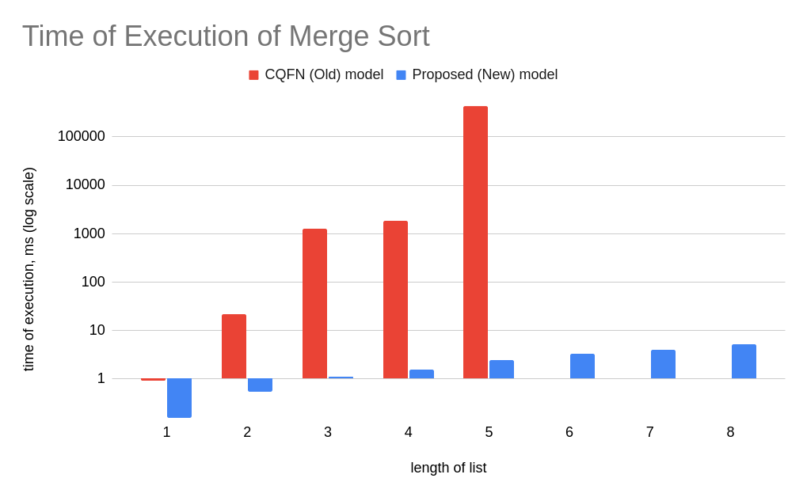
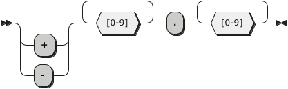
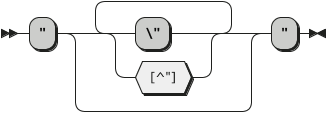
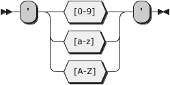

## What this repository is for?
This repository proposes a new transcompilation model of EO programs to Java source codes.  
Moreover, this repository has the documentation on the language and its standard library as well as a collection of examples (see the `sandbox` directory). 

The old (CQFN) model is depicted [here](https://miro.com/app/board/o9J_lM0FZHk=/).

And the visualization of our model can be found [here](https://miro.com/app/board/o9J_lMMDKrk=/).  
Also you might want to read [a draft of our paper](docs/EO%20Programming%20Language%20Transcompilation%20Model%20for%20Java%20Source%20Code%20Generation.pdf) that describes the model.
## How is this transpiler better?
Our transcompilation model has two great advantages:
1. It if much faster than the CQFN original implementation.
2. The output Java code is much easier to read and comprehend. The runtime library is also much more readable and understandable.

You can see the difference in performance of the old and the new models below:
 
Please, refer to [this Google Sheet](https://docs.google.com/spreadsheets/d/1YsalbO6piExC3begifeNNsaz7PEDsqlV3Xx7c6TGbOU/edit?usp=sharing) for more comparisons.

## Table of Contents
- [What this repository is for?](#what-this-repository-is-for)
- [How is this transpiler better?](#how-is-this-transpiler-better)
- [Table of Contents](#table-of-contents)
- [The EO Programming Language Reference](#the-eo-programming-language-reference)
  - [Objects](#objects)
  - [Attributes](#attributes)
    - [Free & Bound Attributes. Binding](#free--bound-attributes-binding)
    - [Accessing Attributes. The Dot Notation](#accessing-attributes-the-dot-notation)
    - [The `@` attribute](#the--attribute)
    - [The `$` attribute](#the--attribute-1)
    - [The `^` attribute](#the--attribute-2)
  - [Abstraction](#abstraction)
  - [Application](#application)
  - [Decoration](#decoration)
  - [Dataization](#dataization)
    - [`!` — Dataize Only Once](#--dataize-only-once)
- [The EO Standard Object Collection](#the-eo-standard-object-collection)
  - [Data Type Objects](#data-type-objects)
    - [`bool` Data Type Object](#bool-data-type-object)
      - [Syntax](#syntax)
      - [`if` Attribute](#if-attribute)
      - [`not` Attribute](#not-attribute)
      - [`and` Attribute](#and-attribute)
      - [`or` Attribute](#or-attribute)
      - [`while` Attribute](#while-attribute)
    - [`float` Data Type Object](#float-data-type-object)
      - [Syntax](#syntax-1)
      - [`eq` Attribute](#eq-attribute)
    - [`string` Data Type Object](#string-data-type-object)
      - [Syntax](#syntax-2)
      - [`eq` Attribute](#eq-attribute-1)
      - [`trim` Attribute](#trim-attribute)
      - [`toInt` Attribute](#toint-attribute)
    - [`int` Data Type Object](#int-data-type-object)
      - [Syntax](#syntax-3)
      - [`eq` Attribute](#eq-attribute-2)
      - [`less` Attribute](#less-attribute)
      - [`add` Attribute](#add-attribute)
      - [`sub` Attribute](#sub-attribute)
      - [`neg` Attribute](#neg-attribute)
      - [`mul` Attribute](#mul-attribute)
      - [`div` Attribute](#div-attribute)
      - [`mod` Attribute](#mod-attribute)
      - [`pow` Attribute](#pow-attribute)
    - [`char` Data Type Object](#char-data-type-object)
      - [Syntax](#syntax-4)
  - [Command Line Interface Output](#command-line-interface-output)
    - [Plain Text Output. `stdout`](#plain-text-output-stdout)
    - [Formatting Strings. `sprintf`](#formatting-strings-sprintf)
  - [Random Number Generation. `random`](#random-number-generation-random)
  - [Arrays](#arrays)
    - [`get` Attribute](#get-attribute)
    - [`append` Attribute](#append-attribute)
    - [`reduce` Attribute](#reduce-attribute)
    - [`map` Attribute](#map-attribute)
    - [`mapi` Attribute](#mapi-attribute)
  - [Sequencing Computations. `seq`](#sequencing-computations-seq)
  - [Mutable Storage in Memory. `memory`](#mutable-storage-in-memory-memory)
- [How to Contribute](#how-to-contribute)
- [How to Run This Code](#how-to-run-this-code)
- [Examples](#examples)
    - [between](#between)
    - [binarytree](#binarytree)
    - [contains](#contains)
    - [count](#count)
    - [factorial](#factorial)
    - [factorialTail](#factorialtail)
    - [fibonacciTail](#fibonaccitail)
    - [first](#first)
    - [floatarrtostdout](#floatarrtostdout)
    - [floatarrtostrarr](#floatarrtostrarr)
    - [imax](#imax)
    - [imin](#imin)
    - [indexof](#indexof)
    - [last](#last)
    - [max](#max)
    - [min](#min)
    - [merge](#merge)
    - [mergesort](#mergesort)
    - [pi](#pi)
    - [remove](#remove)
    - [selectionsort](#selectionsort)
    - [strarrtostdout](#strarrtostdout)
    - [sum](#sum)
    - [unique](#unique)

## The EO Programming Language Reference
This section covers the basic principles that the EO programming language relies on. These are objects, attributes, and four elemental operations — abstraction, application, decoration, and dataization.
### Objects
**Objects** are a centric notion of the EO programming language. Essentially, an **object** is a set of *attributes*. An object connects with and links other objects through its attributes to compose a new concept that the object abstracts.  
An **abstract object** is an object that has at least one [free attribute](#free--bound-attributes-binding).  
This is an example of an abstract object:  
```
[a b] > sum
  a.add b > @
  a > leftOperand
  b > rightOperand
```  
A **closed object** is an object whose all attributes are [bound](#free--bound-attributes-binding).  
These are examples of closed objects:  
```
# Application can turn an abstract object to a closed one
sum 2 5 > closedCopyOfSum
# Abstraction can declare closed objects
[] > zero
  0 > @
  "0" > stringValue
  # Closed objects may have abstract attributes
  [x] > add
    sum 0 x > @ 
  # And closed attributes, too
  [] > neg
    -0 > @
  $.add 1 > addOne
```  
### Attributes
An **attribute** is a pair of a name and a value, where a value of an attribute is another object. That is because `"Everything in EO is an object"`. Hence, for instance, an attribute `name` of an object `person` may be also referred to as plainly the object `name` of the object `person`.  
#### Free & Bound Attributes. Binding
**Binding** is an operation of associating an attribute's value with some object. An attribute may be bound to some object only once.  
An attribute that is not bound to any object is named a **free attribute**. An attribute that has some object associated with its value is called a **bound attribute**.  
*Free attributes* may be declared through the object [abstraction](#abstraction) only.
*Binding* may be performed either during object declaration using the bind (`>`) operator (see the [abstraction](#abstraction) section for more information) or through object copying (see the [application](#application) section for details).
#### Accessing Attributes. The Dot Notation
There are no access modifiers in the EO programming language. All attributes of all objects are publicly visible and accessible. To access attributes of objects, the dot notation is used. The dot notation can be used to retrieve values of attributes and not to bind attributes with objects.   
##### Example. The Horizontal Dot Notation <!-- omit in toc -->
```
(5.add 7).mul 10 > calc
```
##### Example. The Vertical Dot Notation <!-- omit in toc -->
```
mul. > calc
  add.
    5
    7
  10
```
Here, `add` is an attribute of the object `5` and `mul` is an attribute of the attribute object `add` (or, more precisely, an attribute of an object that `add` abstracts or dataizes to, which is an integer number `int`). 
#### The `@` attribute
The `@` attribute is named `phi` (after the Greek letter `φ`). The `@` character is reserved for the `phi` attribute and cannot be used for any other purpose. Every object has its own and only `@` attribute. The `@` attribute can be bound to a value only once.    
The `@` attribute is used for decorating objects. An object bound to the `@` attribute is referred to as a decoratee (i.e., an object that is being decorated) while the base object of the `@` attribute is a decorator (i.e., an object that decorates the decoratee). Since the `@` attribute may be bound only once, every object may have only one decoratee object. More on the decoration see in [this section](#decoration).    
Besides, the `@` attribute is heavily used in the dataization process (see [this section](#dataization) for more information). 
#### The `$` attribute
The `$` character is reserved for the special attribute `self` that every object has. The `$` attribute is used to refer to the object itself.  
The `$` attribute may be useful to use the result of the object's dataization process for declaring other object's attributes.  
The `$` attribute may be used to access attributes of an object inside of the object with the dot notation (e.g., `$.attrA`), but this notation is redundant.  
#### The `^` attribute
The `^` attribute is used to refer to the parent object.  
The `^` attribute may be used to access attributes of a parent object inside of the current object with the dot notation (e.g., `^.attrA`). 
##### Example <!-- omit in toc -->
```
[] > parentObject
  42 > magicNumbe
  [] > childObject
    24 > magicNumber
    add. > @
      ^.magicNumber # refers to the parent object's attr
      magicNumber # refers to $.magicNumber
``` 
### Abstraction
**Abstraction** is the operation of declaring a new object. Abstraction allows declaring both abstract and closed, anonymous and named objects.  
If we are to compare abstraction and application, we can conclude that **abstraction** allows broadening the field of concepts (objects) by declaring new objects. *Application* allows enriching the objects declared through *abstraction* by defining the actual links between the concepts. 
#### Syntax <!-- omit in toc -->
The abstraction syntax includes the following elements:  
1. *(optional)* One or more comment lines before (e.g., `# comment`).
2. A sequence of free attributes in square brackets. The sequence may be:
   1. Empty (`[]`). In this case, the declared object has no free attributes.  
   2. Containing one or more attribute names (`[a]` or `[a b c d e]`). In this case, the listed attribute names are the free attributes of the declared object.  
   3. Containing a variable-length attribute (`[animals...]`). The attribute must be at the end of the list of attributes to work properly. Internally, this attribute is represented by the `array` object.
3. *(optional)* Binding to a name (` > myObject`). Declared objects may be anonymous. However, anonymous objects must be used in application only (i.e., we can only supply anonymous objects for binding them to free attributes during application).  
4. *(optional)* The object may be declared as constant (i.e., dataized only once (see [this section](#--dataize-only-once))), if the object is bound to a name (see #3). For this, the `!` operator is used.  
5. *(optional)* The object may be declared as an atom (i.e., its implementation is made out of the EO language (for instance, in Java)) if the object is bound to a name (see #3). For this, the `/` operator is used (for example, `/bool`).  
#### Anonymous Abstraction <!-- omit in toc -->
There are two types of anonymous abstraction: inline and plain multi-line.  
**Plain Multi-line Anonymous Abstraction**   
```
[a b]
  a.add b > @
```
The same can be expressed in just one line.  
**Inline Anonymous Abstraction**  
```
[a b] a.add b
```  
**EBNF**  
```EBNF
abstraction ::= ( COMMENT '^' )*
               '[' ( attribute ( ' ' attribute )* )? ']'
                ( (' ' '>' ' ' label '!'?) ( ' ' '/' NAME )? )?
            
attribute ::= label
label ::= '@' | NAME '...'?
NAME ::= [a-z][a-z0-9_A-Z]*
```
**Railroad Diagram**  
  
#### Examples <!-- omit in toc -->
```
# no free attributes abstraction
[] > magicalObject
  # here we use application to define an attribute
  42 > magicalNumber

  # and here we use abstraction to define an attribute
  [a] > addSomeMagic
    # application again
    magicalNumber.add a > @

# variable-length attribute abstraction
[a b c args...] > app
  # the next five lines are examples of application
  stdout > @
    sprintf
      "\n%d\n%d\n"
      args.get 0
      magicalObject.magicalNumber.add a

# anonymous abstraction
[args...] > app
  reduce. > sum
    args
    0
    [accumulator current] # <--- this is anonymous abstraction
      add. > @
        accumulator
        current.toInt

# inline anonymous abstraction
[args...] > app
  reduce. > sum
    args
    0
    # inline anonymous abstraction
    [accumulator current] accumulator.add (current.toInt)
``` 
### Application
**Application** is the operation of copying an object previously declared with abstraction optionally binding all or part of its free attributes to some objects.  
If we are to compare abstraction and application, we can conclude that *abstraction* allows broadening the field of concepts (objects) by declaring new objects. **Application** produces more concrete and specific copies of objects declared through *abstraction* by defining the actual links between the concepts by binding their free attributes. 
#### Syntax <!-- omit in toc -->
The application syntax is quite wide, so let's point out the constituents to perform the application:  
1. An object being applied/copied.
   1. It may be any existing (i.e., previously declared) object of any form — abstract, closed, anonymous, or named.
   2. It may be also an attribute object. In this case, both horizontal and vertical [dot notations](#accessing-attributes-the-dot-notation) can be used to access that attribute object.
2. A sequence of objects to bind to the free attributes of the applied object. The sequence may be placed in-line (horizontally) or vertically, one indentation level deeper relatively the copied object level. The sequence may be:
   1. Empty. In this case, the applied object will stay abstract or closed, as it was before.  
   2. Containing one or more objects. In this case, the listed objects will be bound to the free attributes of the applied object in their order of appearance.  
   3. Containing one or more objects with names after each (like `1:a 5:b 9:c`). In this case, the listed objects will be bound to the corresponding free attributes of the applied object.
3. *(optional)* Binding to a name (` > myObject`).  
4. *(optional)* The copied object may be declared as constant (i.e., dataized only once (see [this section](#--dataize-only-once))), if the object is bound to a name (see #3). For this, the `!` operator is used.    
#### Partial Application <!-- omit in toc -->
**This implementation of the EO programming language DOES NOT support partial application yet. It was one of the design desicion made. However, it might change in future!**  

Essentially, application is used to bind free attributes of abstract objects to make their concrete and more specific copies. Application allows binding arbitrary number of free attributes, which can be used to partially apply objects.  
```
# abstract object
[a b] > sum
  a.add b > @

# we can partially apply it to create a new, more specific concept
sum 10 > addTen
# we can apply this copied object, too
addTen 10 > twenty
```
#### Examples <!-- omit in toc -->
```
# here application with no binding
42 > magicalNumber

# horizontal application of 
# the add attribute of the magicalNumber
magicalNumber.add 1 > secondMagicalNumber

# vertical application
# & application inside application
sub. > esotericNumericalEssence
  mul.
    add.
      magicalNumber
      22
    17
  10
``` 
### Decoration
**Decoration** is the operation of extending one object's (`the decoratee`) attributes with attributes of the other object (`the decorator`). Through decoration, the decorator fetches all the attributes of the decoratee and adds up new own attributes. Hence, the decorator represents the decoratee with some extension in the functionality.  
#### Syntax <!-- omit in toc -->  
The decorator's `@` attribute should be bound to the decoratee object in order to perform the decoration operation.  
The syntax for the decoration operation is as follows:  
```
[] > theDecorator
  theDecoratee > @
```
Here, `theDecorator` can access all the attributes of `theDecoratee` and use them to define its own attributes.
#### Example <!-- omit in toc -->
Say, we have the `purchase` object that represents a purchase of some item that has a name, cost, and quantity. The `purchaseTotal` decorates it and adds new functionality of calculating the total.
```
[itemName itemCost itemQuantity] > purchase
  itemName > @

[] > purchaseTotal
  purchase > @
  mul. > total
    @.itemCost
    @.itemQuantity
```
Now we can access all attributes of `purchase` and `purchaseTotal`  through a copy of `purchaseTotal`.
### Dataization
**Dataization** is the operation of evaluation of data laying behind an object. The dataization process (denoted hereby as `D(something)`) is recursive and consists of the following steps:  
1. `D(obj) = obj` if `obj` is a data object. Data objects are `int`, `float`, `string`, `char`, `bytes`.  
2. If the `obj` is an atom (atoms are objects that are implemented outside EO), then `D(obj)` is the data returned by the code behind the atom.  
3. Otherwise, `D(obj) = D(obj.@)`. That is, if the object is neither data nor an atom, then the object "asks" its decoratee to find the data behind it.  
  
It is important to note that if the `@` attribute of the object (or any underlying object in the dataization recursive evaluation tree) is absent (free), then the dataization will fail.  
If we want to dataize the object `x`, all objects and attributes that are used in the definition of the `@` attribute of the `x` will be dataized. Like this, if we want to dataize the attribute `x.attr`, all objects and attributes that are used in the definition of its `@` attribute will be dataized.  
The opposite is true. If the attribute `x.attr` or the object `x` itself are not used in the declaration of `y`, then `D(y)` will not dataize them and they will not be evaluated and executed. Thus, the dataization operation may be referred to as the lazy object evaluation (i.e., EO dataizes objects only when this is needed).    
#### `!` — Dataize Only Once
`not implemented`

## The EO Standard Object Collection
This section covers *The EO Standard Object Collection* which is a library of utility objects for writing programs in *EO*.  
### Data Type Objects  
*The EO Programming Language* and *The EO Standard Object Collection* defines these data type objects: `bool`, `int`, `float`, `string`, `char`. 
#### `bool` Data Type Object
The `bool` data type object represents a boolean value (either `true` or `false`) that can be used for performing logical operations.  
**Fully Qualified Name:** `org.org.eolang.bool` (no aliasing or FQN reference required since the object is automatically imported).  
##### Syntax
The `bool` data type object may be parsed by the EO compiler directly from the source code. The syntax rules for `bool` values are as follows.  
**EBNF Notation**  
```EBNF
BOOL     ::= 'true'
           | 'false'
```
**Railroad Diagram**  
  
###### Example <!-- omit in toc -->
```
+package sandbox
+alias sprintf org.org.eolang.txt.sprintf
+alias stdout org.org.eolang.io.stdout
[args...] > app
  stdout > @
    sprintf
      "%b\n%b\n"
      true
      false

```
**Running**   
```
IN$: ./run.sh
OUT>: true
OUT>: false
IN$: 
```
##### `if` Attribute
The `if` attribute object is used for value substitution based on a condition that can be evaluated as a `bool` object.  
The `if` attribute object has two free attributes:  
1. `t` for the substitution if the base `bool` object is `true`.  
2. `f` for the substitution if the base `bool` object is `false`.  
  
If the `if` attribute object is fully applied, it represents the corresponding substitution value.   
###### Example <!-- omit in toc -->
```
+package sandbox
+alias sprintf org.org.eolang.txt.sprintf
+alias stdout org.org.eolang.io.stdout

[args...] > app
  stdout > @
    sprintf
      "%s\n%s\n%s\nThe max(2, 5) is: %d\n"
      true.if
        "the first value is true"
        "the first value is false"
      false.if
        "the second value is true"
        "the second value is false"
      if.
        2.less 3
        "2 is less than 3"
        "2 is not less than 3"
      (5.less 2).if
        2
        5

```
**Running**  
```
IN$: ./run.sh
OUT>: the first value is true
OUT>: the second value is false
OUT>: 2 is less than 3
OUT>: The max(2, 5) is: 5
IN$: 
```
##### `not` Attribute
The `not` attribute object represents a `bool` object with the inversed inner value of its base `bool` object.  
The `not` attribute object has no free attributes.  
###### Example <!-- omit in toc -->
In this example, all the answers from the previous example (the `if` attribute section) are inversed with the `not` attribute.  
```
+package sandbox
+alias sprintf org.org.eolang.txt.sprintf
+alias stdout org.org.eolang.io.stdout

[args...] > app
  stdout > @
    sprintf
      "[NOT Edition (all the answers are inversed with .not)]\n%s\n%s\n%s\nThe max(2, 5) is: %d\n"
      true.not.if
        "the first value is true"
        "the first value is false"
      false.not.if
        "the second value is true"
        "the second value is false"
      if.
        (2.less 3).not
        "2 is less than 3"
        "2 is not less than 3"
      (5.less 2).not.if
        2
        5

```
**Running**  
```
IN$: ./run.sh
OUT>: [NOT Edition (all the answers are inversed with .not)]
OUT>: the first value is false
OUT>: the second value is true
OUT>: 2 is not less than 3
OUT>: The max(2, 5) is: 2
IN$: 
```
##### `and` Attribute
The `and` attribute object represents logical conjunction on a variety of `bool` objects.  
The `and` attribute object has one free attribute `x` for the `bool` objects (conjuncts). `x` may be empty or may have any number of `bool` objects.  
  
If the `and` attribute object is applied, it represents the conjunction of the base `bool` object and all the objects bound to the `x` attribute.  
###### Example <!-- omit in toc -->
```
+package sandbox
+alias sprintf org.org.eolang.txt.sprintf
+alias stdout org.org.eolang.io.stdout

[args...] > app
  true > a
  true > b
  true > c
  false > d
  stdout > @
    sprintf
      "a && b = %b\na && b && c = %b\na && b && c && d = %b\n"
      a.and b
      a.and b c
      and.
        a
        b
        c
        d

```
**Running**  
```
IN$: ./run.sh
OUT>: a && b = true
OUT>: a && b && c = true
OUT>: a && b && c && d = false
IN$: 
```
##### `or` Attribute
The `or` attribute object represents logical disjunction on a variety of `bool` objects.  
The `or` attribute object has one free attribute `x` for the `bool` objects (disjuncts). `x` may be empty or may have any number of `bool` objects.  
  
If the `or` attribute object is applied, it represents the disjunction of the base `bool` object and all the objects bound to the `x` attribute.    
###### Example <!-- omit in toc -->
```
+package sandbox
+alias sprintf org.org.eolang.txt.sprintf
+alias stdout org.org.eolang.io.stdout

[args...] > app
  false > a
  false > b
  false > c
  true > d
  stdout > @
    sprintf
      "a || b = %b\na || b || c = %b\na || b || c || d = %b\n"
      a.or b
      a.or b c
      or.
        a
        b
        c
        d

```
**Running**  
```
IN$: ./run.sh
OUT>: a || b = false
OUT>: a || b || c = false
OUT>: a || b || c || d = true
IN$: 
```
##### `while` Attribute
**This implementation of the EO programming language DOES NOT support the bool.while standard attribute. This was the conceptual design decision that might change in future!**

The `while` attribute object is used to evaluate its `f` free attribute until the base `bool` object is not `false`.  
The `f` attribute object must have the free attribute `i` (the current iteration of the `while` loop).  
On dataization, the `while` attribute object evaluates to the number of iterations the loop took.  
Since objects are immutable, the `memory` object should be used as the loop condition (i.e., the base `bool` object of the `while` attribute). Moreover, the `memory` object should be changed somehow inside the `f`, otherwise the `while` will evaluate infinitely. 
###### Example <!-- omit in toc -->
```
+package sandbox
+alias stdout org.org.eolang.io.stdout
+alias sprintf org.org.eolang.txt.sprintf

[args...] > app
  memory > x
  seq > @
    x.write 0
    while.
      x.less 11
      [i]
        seq > @
          stdout
            sprintf "%d x %d x %d = %d\n" x x i (x.mul (x.mul i))
          x.write (x.add 1)
```
Here, the `i` attribute of the `f` iteration object is used to find the `x^3`. However, the `i` attribute may stay unused inside the `f`.  
**Running**  
```
IN$: ./run.sh
OUT>: 0 x 0 x 0 = 0
OUT>: 1 x 1 x 1 = 1
OUT>: 2 x 2 x 2 = 8
OUT>: 3 x 3 x 3 = 27
OUT>: 4 x 4 x 4 = 64
OUT>: 5 x 5 x 5 = 125
OUT>: 6 x 6 x 6 = 216
OUT>: 7 x 7 x 7 = 343
OUT>: 8 x 8 x 8 = 512
OUT>: 9 x 9 x 9 = 729
OUT>: 10 x 10 x 10 = 1000
IN$: 
```
#### `float` Data Type Object
The `float` data type object represents a double-precision 64-bit IEEE 754 floating-point number and can be used to perform various `FPU` computations.  
**Fully Qualified Name:** `org.org.eolang.float` (no aliasing or FQN reference required since the object is automatically imported).  
##### Syntax
The `float` data type object may be parsed by the EO compiler directly from the source code. The syntax rules for values are as follows.  
**EBNF Notation**  
```EBNF
FLOAT    ::= ( '+' | '-' )? [0-9]+ '.' [0-9]+
```
**Railroad Diagram**  
  
###### Example <!-- omit in toc -->
```
+package sandbox
+alias sprintf org.org.eolang.txt.sprintf
+alias stdout org.org.eolang.io.stdout

[args...] > app
  stdout > @
    sprintf
      "%f\n%f\n"
      1.5
      -3.71

```
**Running**  
```
IN$: ./run.sh
OUT>: 1.500000
OUT>: -3.710000
IN$: 
```
##### `eq` Attribute
The `eq` attribute object is used for testing if two `float` objects are equal.    
The `eq` attribute object has one free attribute `x` of type `float` that is the second object (the first object is the base object of the `eq` attribute).    
If the `eq` attribute object is applied, it represents the result of the equality test (either `true` (if the objects are equal) or `false` (otherwise)).  
###### Example <!-- omit in toc -->
```
+package sandbox
+alias sprintf org.org.eolang.txt.sprintf
+alias stdout org.org.eolang.io.stdout

[args...] > app
  stdout > @
    sprintf
      "%b\n%b\n"
      1.5.eq 1.5
      -3.71.eq 3.71

```
**Running**  
```
IN$: ./run.sh
OUT>: true
OUT>: false
IN$: 
```
#### `string` Data Type Object
The `string` data type object represents a string literal.  
**Fully Qualified Name:** `org.org.eolang.string` (no aliasing or FQN reference required since the object is automatically imported).  
##### Syntax
The `string` data type object may be parsed by the EO compiler directly from the source code. The syntax rules for values are as follows.  
**EBNF Notation**  
```EBNF
STRING   ::= '"' ( '\"' | [^"] )* '"'
```
**Railroad Diagram**  
  
###### Example <!-- omit in toc -->
```
+package sandbox
+alias sprintf org.org.eolang.txt.sprintf
+alias stdout org.org.eolang.io.stdout

[args...] > app
  stdout > @
    sprintf
      "%s%s%s"
      "Hello, "
      "World! Welcome to The \"EO Docs\"!"
      "\n"

```
**Running**  
```
IN$: ./run.sh
OUT>: Hello, World! Welcome to The "EO Docs"!
IN$: 
```
##### `eq` Attribute
The `eq` attribute object is used for testing if two `string` objects are equal.    
The `eq` attribute object has one free attribute `x` of type `string` that is the second object (the first object is the base object of the `eq` attribute).    
If the `eq` attribute object is fully applied, it represents the result of the equality test (either `true` (if the objects are equal) or `false` (otherwise)).  
###### Example <!-- omit in toc -->
```
+package sandbox
+alias sprintf org.org.eolang.txt.sprintf
+alias stdout org.org.eolang.io.stdout

[args...] > app
  stdout > @
    sprintf
      "%b\n%b\n%b\n"
      "".eq ""
      "Hey".eq "Hey"
      "Hey".eq "hey"

```
**Running**  
```
IN$: ./run.sh
OUT>: true
OUT>: true
OUT>: false
IN$: 
```
##### `trim` Attribute
The `trim` attribute object is used for trimming the base `string` object (i.e. `trim` is a `string` with whitespace removed from both ends of the base `string`).    
The `trim` attribute object has no free attributes.  
If the `trim` attribute object is applied (called), it represents the resulting trimmed `string`.  
###### Example <!-- omit in toc -->
```
+package sandbox
+alias sprintf org.org.eolang.txt.sprintf
+alias stdout org.org.eolang.io.stdout

[args...] > app
  stdout > @
    sprintf
      "%s%s%s"
      "  Hello There  ".trim
      "            !           ".trim
      "\n".trim

```
**Running**  
```
IN$: ./run.sh
OUT>: Hello There!IN$: 
```
Here, the `\n` escape sequence is trimmed as it is a whitespace character. 
##### `toInt` Attribute
The `toInt` attribute object is used for parsing the base `string` object as an `int` object.  
The format of the base `string` object must be as described below:  
1. The first character of the `string` literal may be either `+` or `-`. This indicates the sign of the `int` value. The sign may be omitted (in such a case, the number is positive).  
2. All the other characters of the `string` literal must be decimal digits (`0-9`). 
  
If the format of the base `string` object is incorrect, the `toInt` attribute will fail on its application.  
The `toInt` attribute object has no free attributes.  
If the `toInt` attribute object is applied (called), it represents the parsed `int` object.  
###### Example <!-- omit in toc -->
```
+package sandbox
+alias sprintf org.org.eolang.txt.sprintf
+alias stdout org.org.eolang.io.stdout

[args...] > app
  stdout > @
    sprintf
      "%d\n%d\n%d\n%d\n"
      "1700".toInt
      "-1500".toInt
      "8".toInt
      "-0".toInt

```
**Running**  
```
IN$: ./run.sh
OUT>: 1700
OUT>: -1500
OUT>: 8
OUT>: 0
IN$: 
```
#### `int` Data Type Object
The `int` data type object represents a 64-bit integer number.  
**Fully Qualified Name:** `org.org.eolang.int` (no aliasing or FQN reference required since the object is automatically imported).  
##### Syntax
The `int` data type object may be parsed by the EO compiler directly from the source code. The syntax rules for values are as follows.  
**EBNF Notation**  
```EBNF
INT      ::= ( '+' | '-' )? [0-9]+
```
There is also an alternative syntax for hexadecimal numerals (i.e., with the base `16`). This notation implies only non-negative values.
```EBNF
HEX      ::= '0x' [0-9a-f]+
```
**Railroad Diagram**  
  
And an alternative notation for HEX integers:  
")  
###### Example <!-- omit in toc -->
```
+package sandbox
+alias sprintf org.org.eolang.txt.sprintf
+alias stdout org.org.eolang.io.stdout

[args...] > app
  stdout > @
    sprintf
      "%d\n%d\n%d\n%#01x\n"
      -157
      1009283
      0xf.add 1
      0xa

```
**Running**  
```
IN$: ./run.sh
OUT>: -157
OUT>: 1009283
OUT>: 16
OUT>: 0xa
IN$: 
```
##### `eq` Attribute
The `eq` attribute object is used for testing if two `int` objects are equal.    
The `eq` attribute object has one free attribute `x` of type `int` that is the second object (the first object is the base object of the `eq` attribute).    
If the `eq` attribute object is fully applied, it represents the result of the equality testing (either `true` (if the objects are equal) or `false` (otherwise)).  
###### Example <!-- omit in toc -->
```
+package sandbox
+alias sprintf org.org.eolang.txt.sprintf
+alias stdout org.org.eolang.io.stdout

[args...] > app
  stdout > @
    sprintf
      "%b\n%b\n"
      eq.
        0xf
        15
      15.eq (0xf.add 1)

```
**Running**  
```
IN$: ./run.sh
OUT>: true
OUT>: false
IN$: 
```
##### `less` Attribute
The `less` attribute object is used for testing if its base `int` object is less than its `x` free attribute (i.e. `$ < x`).  
If the `less` attribute object is fully applied, it represents the result of the testing (either `true` (if the base object is less than `x` free attribute of the `less`) or `false` (otherwise)).  
###### Example <!-- omit in toc -->
```
+package sandbox
+alias sprintf org.org.eolang.txt.sprintf
+alias stdout org.org.eolang.io.stdout

[args...] > app
  stdout > @
    sprintf
      "%b\n%b\n"
      -7.less 0
      less.
        0
        0

```
**Running**  
```
IN$: ./run.sh
OUT>: true
OUT>: false
IN$: 
```
##### `add` Attribute
The `add` attribute object is used to calculate the sum of its base `int` object and the free attribute `x` of type `int` (i.e. `$+x`).  
If the `add` attribute object is fully applied, it represents the resulting sum of the integer numbers.  
###### Example <!-- omit in toc -->
```
+package sandbox
+alias sprintf org.org.eolang.txt.sprintf
+alias stdout org.org.eolang.io.stdout

[args...] > app
  stdout > @
    sprintf
      "%d\n%d\n"
      add.
        0x10
        16
      -16.add 0x10

```
**Running**  
```
IN$: ./run.sh
OUT>: 32
OUT>: 0
IN$: 
```
##### `sub` Attribute
The `sub` attribute object is used to calculate the difference between its base `int` object and the free attribute `x` of type `int` (i.e. `$-x`).  
If the `sub` attribute object is fully applied, it represents the resulting difference of the integer numbers.  
###### Example <!-- omit in toc -->
```
+package sandbox
+alias sprintf org.org.eolang.txt.sprintf
+alias stdout org.org.eolang.io.stdout

[args...] > app
  stdout > @
    sprintf
      "%d\n%d\n"
      sub.
        0x10
        16
      -16.sub 0x10

```
**Running**  
```
IN$: ./run.sh
OUT>: 0
OUT>: -32
IN$: 
```
##### `neg` Attribute
The `neg` attribute object is used to negate its base `int` object (i.e. `-$`).  
If the `neg` attribute object is applied (called), it represents the resulting negation of the base `int` object.  
###### Example <!-- omit in toc -->
```
+package sandbox
+alias sprintf org.org.eolang.txt.sprintf
+alias stdout org.org.eolang.io.stdout

[args...] > app
  stdout > @
    sprintf
      "%d\n%d\n%d\n%d\n"
      5.neg
      0x10.neg
      (17.add 3).neg
      17.neg.add 3

```
**Running**  
```
IN$: ./run.sh
OUT>: -5
OUT>: -16
OUT>: -20
OUT>: -14
IN$: 
```
##### `mul` Attribute
The `mul` attribute object is used to calculate the product of its base `int` object and the free attribute `x` of type `int` (i.e. `$ × x`).  
If the `mul` attribute object is fully applied, it represents the resulting product of the integer numbers.  
###### Example <!-- omit in toc -->
```
+package sandbox
+alias sprintf org.org.eolang.txt.sprintf
+alias stdout org.org.eolang.io.stdout

[args...] > app
  stdout > @
    sprintf
      "%d\n%d\n%d\n%d\n%d\n"
      -7.mul 0
      13.mul 1
      mul.
        0x10
        0x10
      ((10.mul 10).mul 10).mul 10
      10.mul 10.mul 10.mul 10

```
**Running**  
```
IN$: ./run.sh
OUT>: 0
OUT>: 13
OUT>: 256
OUT>: 10000
OUT>: 10000
IN$: 
```
##### `div` Attribute
`TODO` (does not work properly at the moment)
##### `mod` Attribute
The `mod` attribute object is used to calculate the floor remainder of the integer division of its base `int` object by the `x` free attribute (i.e. `$ fmod x`).  
If the `mod` attribute object is fully applied, it represents the resulting floor modulus (remainder).  
The modulus for `x = 0` is undefined.
The resulting floor modulus has the same sign as the divisor `x`.  
The relationship between the `mod` and `div` operations is as follows:  
`(x div y) * y + x mod y == x`
###### Example <!-- omit in toc -->
```
+package sandbox
+alias sprintf org.org.eolang.txt.sprintf
+alias stdout org.org.eolang.io.stdout

[args...] > app
  stdout > @
    sprintf
      "%d\n%d\n%d\n%d\n%d\n%d\n"
      2.mod 1
      7.mod 5
      113.mod 10
      113.mod -10
      -113.mod 10
      -113.mod -10

```
**Running**  
```
IN$: ./run.sh
OUT>: 0
OUT>: 2
OUT>: 3
OUT>: -7
OUT>: 7
OUT>: -3
IN$: 
```
##### `pow` Attribute
The `pow` attribute object is used to calculate the power of its base `int` object and the free attribute `x` of type `int` (i.e. `$^x`).  
If the `pow` attribute object is fully applied, it represents the resulting power of the base `int` object raised to the power of the `x` attribute.  
###### Example <!-- omit in toc -->
```
+package sandbox
+alias sprintf org.org.eolang.txt.sprintf
+alias stdout org.org.eolang.io.stdout

[args...] > app
  stdout > @
    sprintf
      "%d\n%d\n%d\n%d\n%d\n"
      2.pow 10
      -2.pow 3
      2.pow -10
      2.pow 0
      2.pow 1

```
**Running**  
```
IN$: ./run.sh
OUT>: 1024
OUT>: -8
OUT>: 0
OUT>: 1
OUT>: 2
IN$: 
```
Here, `2^(-10)` results in `0` as well as raising all the integer numbers (except `0`) to the negative power (`-1, -2, -3, ...`).  
#### `char` Data Type Object
The `char` data type object represents a single character.  

**The `char` object is not implemented yet, hence the `char` cannot be used for now.**  

**Fully Qualified Name:** `org.org.eolang.char` (no aliasing or FQN reference required since the object is automatically imported).  
##### Syntax
The `char` data type object may be parsed by the EO compiler directly from the source code. The syntax rules for values are as follows.  
**EBNF Notation**  
```EBNF
CHAR     ::= "'" [0-9a-zA-Z] "'"
```
**Railroad Diagram**  
  
### Command Line Interface Output
*The EO Standard Object Collection* contains two objects for the CLI output: `sprintf` for strings formatting and `stdout` for plain text output. 
#### Plain Text Output. `stdout`
For plain text output, the `stdout` object is used.   
**Fully Qualified Name:** `org.org.eolang.io.stdout`.
##### Usage <!-- omit in toc -->
The `stdout` object has one free attribute `text` that should be bound to the text to print.  
The object bound to the `text` attribute must be of `string` type.  
The `stdout` does not put the End of Line character at the end of the output, so the `\n` escape sequence should be used in case if such a behavior is needed.  
For the complete list of escape sequences supported by `stdout`, see the corresponding section of [the article](https://docs.oracle.com/javase/tutorial/java/data/characters.html).  
##### Example 1. The Plain Old “Hello, World” <!-- omit in toc -->
```
+package sandbox
+alias stdout org.org.eolang.io.stdout

[args...] > app
  (stdout "Hello, World!\n") > @
``` 
###### Running <!-- omit in toc -->
```
IN$: ./run.sh
OUT>: Hello, World!
IN$: 
```

##### Example 2. Print the First Word of the User's Input <!-- omit in toc -->
```
+package sandbox
+alias stdout org.org.eolang.io.stdout

[args...] > app
  stdout > @
    get.
      args
      0
```
###### Running <!-- omit in toc -->
```
IN$: ./run.sh Hello Bye Thanks Ok
OUT>: HelloIN$: 
```
**Note:** here, the `Hello` is printed with no `EOL` character at the end of the line because of the absence of it in the user input. 

#### Formatting Strings. `sprintf`
For strings formatting, the `sprintf` object is used.  
String formatting is the process of data injection into the string, optionally applying format patterns to the data.  
**Fully Qualified Name:** `org.org.eolang.txt.sprintf`.
##### Usage <!-- omit in toc -->
The `sprintf` object has two free attributes:  
1. `format` for the format `string` that describes the formatting of the resulting `string`.
2. `args` for the data being injected into the string. `args` may be empty or may have any number of objects. `args` must be consistent with the `format` (i.e., the number and the types (as well as their order) of the objects in the `format` and the `args` should be the same).    
  
If the `sprintf` object is fully applied, it represents the resulting formatted `string`.  
For the `format` syntax reference, see [this article](https://docs.oracle.com/javase/8/docs/api/java/util/Formatter.html#syntax).  
##### Example. Format 'Em All <!-- omit in toc -->
```
+package sandbox
+alias sprintf org.org.eolang.txt.sprintf
+alias stdout org.org.eolang.io.stdout

[args...] > app
  sprintf > formatted_string
    "int: %d, bool: %b, string: %s\n"
    2
    (2.less 0)
    "Hey"

  (stdout formatted_string) > @

```  
###### Running <!-- omit in toc -->
```
IN$: ./run.sh
OUT>: int: 2, bool: false, string: Hey
IN$: 
```
### Random Number Generation. `random`
**Not implemented yet in this version of the transpiler!**

*The EO Standard Object Collection* contains the `random` object for generating a cryptographically strong random number.  
**Fully Qualified Name:** `org.org.eolang.random` (no aliasing or FQN reference required since the object is automatically imported).  
#### Usage <!-- omit in toc -->
The `random` object has no free attributes. When applied, the `random` object represents the generated random number that is immutable (i.e. cannot be changed). So, every time the new random number is needed, the new application (initialization) of the `random` object is needed.     
The resulting random number represented by the `random` object is of type `float`.  
The value is in the range `0.0` (inclusive) to `1.0` (exclusive).  
#### Example <!-- omit in toc -->
```
+package sandbox
+alias sprintf org.org.eolang.txt.sprintf
+alias stdout org.org.eolang.io.stdout

[args...] > app
  sprintf > formatted_string
    "the 1st random: %f\nthe 2nd random: %f\nthe 3rd random:%f\n"
    random
    random
    random

  (stdout formatted_string) > @

```  
##### Running <!-- omit in toc -->
```
IN$: ./run.sh
OUT>: the 1st random: 0.125293
OUT>: the 2nd random: 0.074904
OUT>: the 3rd random:0.958538
IN$: 
```
### Arrays
*The EO Standard Object Collection* contains the `array` object for working with arrays of objects.  
**Fully Qualified Name:** `org.org.eolang.array` (no aliasing or FQN reference required since the object is automatically imported).  
#### `get` Attribute
The `get` attribute object is used to retrieve an object stored at the position `i` of the base `array` object.  
The position `i` must be within 0 and the length of the `array` inclusively.  
When applied, the `get` attribute object represents the object stored at the position `i` of the base `array` object.
##### Example <!-- omit in toc -->
```
+package sandbox
+alias sprintf org.org.eolang.txt.sprintf
+alias stdout org.org.eolang.io.stdout

[args...] > app
  stdout > @
    sprintf
      "%s\n%s\n"
      args.get 0
      args.get 1

``` 
In this example, the `args` array is used that consists of the CLI parameters passed to the program.
###### Running <!-- omit in toc -->
```
IN$: ./run.sh Hello, World!
OUT>: Hello,
OUT>: World!
IN$: 
```
#### `append` Attribute
The `append` attribute object is used to append the `x` object at the end of the base `array` object.   
When applied, the `append` attribute object represents the resulting `array` object with the `x` at the end of it. 
##### Example <!-- omit in toc -->
```
+package sandbox
+alias sprintf org.org.eolang.txt.sprintf
+alias stdout org.org.eolang.io.stdout

[args...] > app
  args.append "New Element!" > argsExtended
  stdout > @
    sprintf
      "%s\n%s\n%s\n"
      argsExtended.get 0
      argsExtended.get 1
      argsExtended.get 2

``` 
In this example, the `args` array is used that consists of the CLI parameters passed to the program.
###### Running <!-- omit in toc -->
```
IN$: ./run.sh Hello, World!
OUT>: Hello,
OUT>: World!
OUT>: New Element!
IN$: 
```
#### `reduce` Attribute
The `reduce` attribute object is used to perform the reduction operation of its base `array` object. The reduction is a process of accumulating a set of objects into one aggregated object.  
The `reduce` attribute object has two free attributes:  
1. `a` for the initial value of the accumulator.  
2. `f` for the object that represents the reduction function. It must have two free attributes:  
   1. The first attribute is the current value of the accumulator.  
   2. The second attribute is the current object of the `array`.

The `f` attribute object aggregates the objects of the `array` in the `accumulator`. Objects of the `array` arrive into the `f` in the order these objects are stored in the `array`.      
When applied, the `reduce` attribute object represents the resulting reduced accumulator object. 
##### Example <!-- omit in toc -->
```
+package sandbox
+alias sprintf org.org.eolang.txt.sprintf
+alias stdout org.org.eolang.io.stdout

[args...] > app
  [accumulator current] > reduceFunction
    add. > @
      accumulator
      current.toInt

  reduce. > sum
    args
    0
    reduceFunction

  stdout > @
    sprintf
      "%d\n"
      sum

``` 
In this example, the `args` array is used that consists of the CLI parameters passed to the program. The array of numbers passed into the program is reduced into the sum of its elements. 
###### Running <!-- omit in toc -->
```
IN$: ./run.sh 1 2 3 4 5
OUT>: 15
IN$: 
```
#### `map` Attribute
`TODO` 
#### `mapi` Attribute
`TODO` 
### Sequencing Computations. `seq`
**In this implementation of the EO langage, please, use the `array.each` attribute.**  

*The EO Standard Object Collection* contains the `seq` object for sequencing computations.  
The `seq` object has one free attribute `steps` that may have an arbitrary number of steps that will be evaluated one by one, from the beginning to the end in the sequential order.  
The `seq` object starts the *dataization* process for each of the objects bound to the `steps` attribute of it.  
On dataization, the `seq` object evaluates into the `bool` object `true`.   
**Fully Qualified Name:** `org.org.eolang.seq` (no aliasing or FQN reference required since the object is automatically imported).  
#### Example <!-- omit in toc -->
```
+package sandbox
+alias sprintf org.org.eolang.txt.sprintf
+alias stdout org.org.eolang.io.stdout

[args...] > app
  seq > @
    stdout "Hello\n"
    stdout "These objects\n"
    stdout "will be dataized\n"
    stdout "one by one, in sequential order\n"

``` 
##### Running <!-- omit in toc -->
```
IN$: ./run.sh
OUT>: Hello
OUT>: These objects
OUT>: will be dataized
OUT>: one by one, in sequential order
IN$: 
```
### Mutable Storage in Memory. `memory`
**This implementation of the EO programming language DOES NOT support the memory standard object. This was the conceptual design decision that might change in future!**

*The EO Standard Object Collection* contains the `memory` object for mutable storage in RAM.  
**Fully Qualified Name:** `org.org.eolang.memory` (no aliasing or FQN reference required since the object is automatically imported).  
**Usage**
To use the `memory` object, the following steps are needed:  
1. Make a copy of the `memory` object and bound it to some attribute.  
2. To put an object into the `memory` object, the `write` attribute object is used. It has the `x` free attribute that is the object to put into the `memory`. The `write` attribute evaluates to `true` on dataization.  
3. To retrieve the object stored in the `memory`, dataization of the `memory` object is used.  
##### Example <!-- omit in toc -->
```
+package sandbox
+alias sprintf org.org.eolang.txt.sprintf
+alias stdout org.org.eolang.io.stdout

[args...] > app
  memory > m
  seq > @
    m.write 1
    m.write (m.add 1)
    m.write (m.add 1)
    m.write (m.add 1)
    stdout (sprintf "%d\n" m)

``` 
###### Running <!-- omit in toc -->
```
IN$: ./run.sh
OUT>: 4
IN$: 
```

## How to Contribute

Fork repository, make changes, send us a pull request.
We will review your changes and apply them to the `master` branch shortly,
if they don't violate our quality standards. Before sending us your pull request please run the full Maven build to check whether the transpiler is not broken:

```bash
$  mvn clean install -Pqulice
```

You will need Maven 3.3+ and Java 8+.

## How to Run This Code

You can play with EOLANG here, in a few simple steps:

First, clone this repo to your local machine and go
to the `eo` directory (you will need
[Git](https://git-scm.com/book/en/v2/Getting-Started-Installing-Git)
installed):

```bash
$ git clone https://github.com/cqfn/eo.git
$ cd eo
```
Second, compile the transpiler and the runtime of the EO programming language (you will need
[Maven 3.3+](https://maven.apache.org/)
and [Java SDK 8+](https://www.java.com/en/download/) installed):  
```bash
$ mvn clean install
```  
*You need to run the above command only once. This will install the runtime & the transpiler to your machine.*  
Then, compile the code of the sandbox:
```bash
$ cd sandbox/hse
$ mvn clean compile
```  
Intermediary `*.xml` files will be generated in the `target` directory (it will
be created). Also, there will be `*.java` and `*.class` files. Feel free to analyze
them: EO is parsed into XML, then translated to Java, and then compiled
by Java SDK to Java bytecode. Finally, just run the bytecode program through JRE. For example, to run the Fibonacci example, do the following:  

```bash
$ ./run.sh appFibonacci 9
The program has dataized to: 9th Fibonacci number is 34


real	0m0.177s
user	0m0.175s
sys	0m0.037s

```  
The first argument of `./run.sh` is the name of the object to be dataized, while all the other arguments are passed to that object as its free attributes.  

Have a look at our samples in the [Examples](#examples) section.  


You can modify our `*.eo` files or add yours, just run `mvn clean compile` to compile them
again and then do `run.sh` to run them.

## Examples
- [Examples](#examples)
    - [between](#between)
    - [binarytree](#binarytree)
    - [contains](#contains)
    - [count](#count)
    - [factorial](#factorial)
    - [factorialTail](#factorialtail)
    - [fibonacciTail](#fibonaccitail)
    - [first](#first)
    - [floatarrtostdout](#floatarrtostdout)
    - [floatarrtostrarr](#floatarrtostrarr)
    - [imax](#imax)
    - [imin](#imin)
    - [indexof](#indexof)
    - [last](#last)
    - [max](#max)
    - [min](#min)
    - [merge](#merge)
    - [mergesort](#mergesort)
    - [pi](#pi)
    - [remove](#remove)
    - [selectionsort](#selectionsort)
    - [strarrtostdout](#strarrtostdout)
    - [sum](#sum)
    - [unique](#unique)

#### [between](eo/between.eo)
Checks if the first argument is within the next two arguments.  
*Expects integer arguments in the stdin only*  
[Back to Contents](#examples)  

**How to Run**
```
./run.sh appBetween 1 -5 9
```  

**Result:**  
```
The program has dataized to: 1 is within [-5;9]:yes

real	0m0.177s
user	0m0.179s
sys	0m0.028s
```

#### [binarytree](eo/binarytree.eo)
Constructs this binary tree in RAM:  
```
                |--- nil
      |--- 2 ---|
      |         |--- nil
1 --- |
      |         |--- 4
      |--- 3 ---|
                |--- nil
```  
And then sums its nodes and counts them.  
*Expects no arguments in stdin*  
[Back to Contents](#examples)  

**How to Run**
```
./run.sh appBinaryTree
```  

**Result:**  
```
The program has dataized to: Sum of nodes: 10
Count of nodes:4


real	0m0.210s
user	0m0.197s
sys	0m0.045s
```

#### [contains](eo/contains.eo)
Checks if the first argument is in the input array (the rest arguments).  
*Expects string array in the stdin*  
[Back to Contents](#examples)  

**How to Run**
```
./run.sh appContains 1 8 9 0 9 5 1
```  

**Result:**  
```
The program has dataized to: true

real	0m0.245s
user	0m0.305s
sys	0m0.045s
```

#### [count](eo/count.eo)
Count all the occurences of the first argument in the input array (the rest arguments).  
*Expects string array in the stdin*  
[Back to Contents](#examples)  

**How to Run**
```
./run.sh appCount a a b c d e f g a
```  

**Result:**  
```
The program has dataized to: 2

real	0m0.195s
user	0m0.217s
sys	0m0.034s
```

#### [factorial](eo/factorial.eo)
Evaluates to the factorial of `n` (plain recursion algorithm).  
*Expects integer n in the stdin only*  
[Back to Contents](#examples)  

**How to Run**
```
./run.sh appFactorial 10
```  

**Result:**  
```
The program has dataized to: 10! = 3628800

real	0m0.155s
user	0m0.167s
sys	0m0.013s

```

#### [factorialTail](eo/factorialTail.eo)
Evaluates to the factorial of `n` (tail recursion algorithm).  
*Expects integer n in the stdin only*  
[Back to Contents](#examples)  

**How to Run**
```
./run.sh appFactorialTail 10
```  

**Result:**  
```
The program has dataized to: 10! = 3628800

real	0m0.176s
user	0m0.198s
sys	0m0.005s
```

#### [fibonacciTail](eo/fibonacciTail.eo)
Evaluates to the Fibonacci number #n (tail recursion algorithm).  
*Expects integer n in the stdin only*  
[Back to Contents](#examples)  

**How to Run**
```
./run.sh appFibonacciTail 100
```  

**Result:**  
```
The program has dataized to: 100th Fibonacci number is 3736710778780434371

real	0m0.188s
user	0m0.205s
sys	0m0.046s
```

#### [first](eo/first.eo)
Returns the first element of the given array[5,2,3] or returns error if array is empty  
 
[Back to Contents](#examples)  

**How to Run**
```
./run.sh appFirst
```  

**Result:**  
```
The program has dataized to: 5

real    0m0.288s
user    0m0.139s
sys     0m0.094s

```

#### [floatarrtostdout](eo/floatarrtostdout.eo)
Prints an array of floating point numbers to the console.  
 
[Back to Contents](#examples)  

**How to Run**
```
./run.sh appFloatArrToStdOut
```  

**Result:**  
```
5.000000 
2.200000 
3.100000 
The program has dataized to: true

real    0m0.184s
user    0m0.139s
sys     0m0.046s

```

#### [floatarrtostrarr](eo/floatarrtostrarr.eo)
Converts an array of floats to a string array.
 
[Back to Contents](#examples)  

**How to Run**
```
./run.sh appFloatArrToStrArr
```  

**Result:**  
```
5.000000 
2.200000 
3.100000 
The program has dataized to: true

real    0m0.168s
user    0m0.133s
sys     0m0.045s

```

#### [imax](eo/imax.eo)
Returns the index of the max element in the array[5,2,3] or error if empty 

[Back to Contents](#examples)  

**How to Run**
```
./run.sh appImax
```  

**Result:**  
```
0
The program has dataized to: 0

real    0m0.207s
user    0m0.144s
sys     0m0.048s

```

#### [imin](eo/imin.eo)
Returns the index of the min element in the array[5,2,3] or error if empty 

[Back to Contents](#examples)  

**How to Run**
```
./run.sh appImin
```  

**Result:**  
```
1
The program has dataized to: 1

real    0m0.210s
user    0m0.156s
sys     0m0.047s

```

#### [indexof](eo/indexof.eo)
Returns the index of the first element in the array[5,2,3] equal to the given one[3], otherwise returns -1. 

[Back to Contents](#examples)  

**How to Run**
```
./run.sh appIndexOf
```  

**Result:**  
```
2
The program has dataized to: 2

real    0m0.217s
user    0m0.144s
sys     0m0.051s

```

#### [last](eo/last.eo)
Returns the last element of the array or error if empty 

[Back to Contents](#examples)  

**How to Run**
```
./run.sh appLast
```  

**Result:**  
```
4
The program has dataized to: 4

real    0m0.677s
user    0m0.178s
sys     0m0.115s

```

#### [max](eo/max.eo)
Returns the max element of the array or error if empty 

[Back to Contents](#examples)  

**How to Run**
```
./run.sh appMax
```  

**Result:**  
```
5
The program has dataized to: 5

real    0m0.478s
user    0m0.173s
sys     0m0.104s

```

#### [min](eo/min.eo)
Returns the min element of the array[5,2,4] or error if empty 

[Back to Contents](#examples)  

**How to Run**
```
./run.sh appMin
```  

**Result:**  
```
2
The program has dataized to: 2

real    0m0.304s
user    0m0.138s
sys     0m0.049s

```

#### [merge](eo/merge.eo)
Performs the merge of to arrays[1,2] and [3,4].  

[Back to Contents](#examples)  

**How to Run**
```
./run.sh appMerge 
```  

**Result:**  
```
1 
2 
3 
4 
The program has dataized to: true

real    0m0.203s
user    0m0.149s
sys     0m0.047s

```

#### [mergesort](eo/mergesort.eo)
Performs the merge sorting of the input array.  
*Expects integer array in the stdin only*  
[Back to Contents](#examples)  

**How to Run**
```
./run.sh appMergesort 5 9 4 3 1 0
```  

**Result:**  
```
0 
1 
3 
4 
5 
9 
The program has dataized to: true

real	0m5.741s
user	0m6.557s
sys	0m0.178s
```

#### [pi](eo/pi.eo)
Evaluates to the pi value. The greater `n` is, the more precisely the `pi` is computed.  
*Expects integer n in the stdin only*  
[Back to Contents](#examples)  

**How to Run**
```
./run.sh appPi 10000
```  

**Result:**  
```
The program has dataized to: Actual value = 3.1415926535; computed value(n=10000) = 3.1416926436

real	0m1.468s
user	0m2.042s
sys	0m0.090s
```

#### [remove](eo/remove.eo)
Removes the first occurence of the first argument from the input array (the rest arguments).  
*Expects string array in the stdin*  
[Back to Contents](#examples)  

**How to Run**
```
./run.sh appRemove 1 0 5 7 8 9 1 4 1
```  

**Result:**  
```
0 
5 
7 
8 
9 
4 
1
The program has dataized to: true

real	0m0.461s
user	0m0.998s
sys	0m0.055s
```

#### [selectionsort](eo/selectionsort.eo)
Performs the selection sorting of the input array.  
*Expects integer array in the stdin only*  
[Back to Contents](#examples)  

**How to Run**
```
./run.sh appSelectionsort 5 1
```  

**Result:**  
```
1 
5 
The program has dataized to: true

real	0m2.706s
user	0m3.420s
sys	0m0.140s
```

#### [strarrtostdout](eo/strarrtostdout.eo)
Prints string arrays.  
[Back to Contents](#examples)  

**How to Run**
```
./run.sh appStrarrtostdout a aa aaa
```  

**Result:**  
```
a 
aa 
aaa 
The program has dataized to: true

real	0m0.176s
user	0m0.174s
sys	0m0.034s
```

#### [sum](eo/sum.eo)
Evaluates to the sum of numbers of the input array.  
*Expects integer arrays in the stdin only*  
[Back to Contents](#examples)  

**How to Run**
```
./run.sh appSum 10 10 10 10 10 1 1 1 1 1
```  

**Result:**  
```
The program has dataized to: 55

real	0m0.181s
user	0m0.188s
sys	0m0.027s
```

#### [unique](eo/unique.eo)
Evaluates to the array that contains only unique values of the input array.  
[Back to Contents](#examples)

**How to Run**
```
./run.sh appUnique a b a a c d c c c d d e
```  

**Result:**  
```
a 
b 
c 
d 
e 
The program has dataized to: true

real	0m0.236s
user	0m0.335s
sys	0m0.047s
```